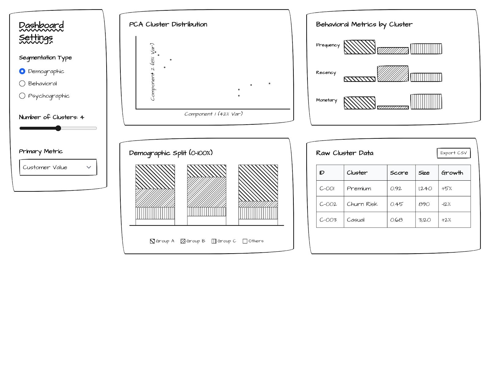
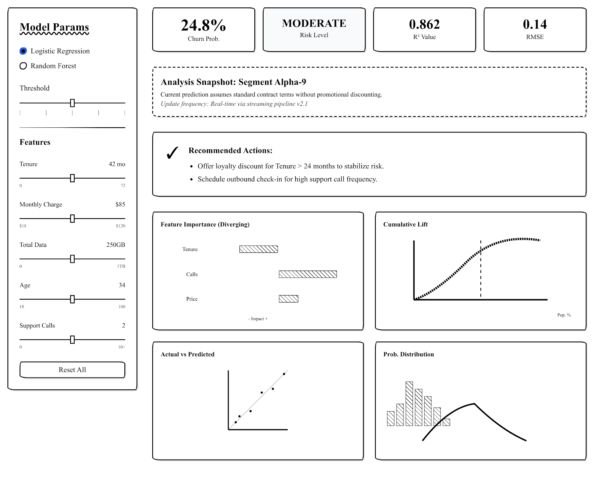

```{=html}
<script src="https://cdn.tailwindcss.com?plugins=forms,container-queries"></script>
<link href="https://fonts.googleapis.com/css2?family=Inter:wght@400;500;600;700;900&display=swap" rel="stylesheet"/>
<link href="https://fonts.googleapis.com/css2?family=Material+Symbols+Outlined:wght,FILL@100..700,0..1&display=swap" rel="stylesheet"/>
<script>
  tailwind.config = {
    darkMode: "class",
    theme: {
      extend: {
        colors: {
          "primary": "#f97415",
          "background-light": "#080808",
          "background-dark": "#080808",
          "card-dark": "#121212",
        },
        fontFamily: {
          "display": ["Inter"]
        },
        borderRadius: {"DEFAULT": "0.5rem", "lg": "1rem", "xl": "1.5rem", "full": "9999px"},
      },
    },
  }
</script>
<script>
  document.addEventListener('DOMContentLoaded', function() {
    document.documentElement.classList.add('dark');
  });
</script>
<style>
  /* Remove all Quarto default styles */
  #title-block-header { display: none !important; }
  .quarto-title { display: none !important; }
  header#title-block-header { display: none !important; }
  header { display: none !important; }
  #quarto-content { margin: 0 !important; padding: 0 !important; }
  .page-columns { display: block !important; }
  body > div.container-fluid, body > .container-lg { max-width: 100% !important; padding: 0 !important; margin: 0 !important; }
  main.content { margin: 0 !important; padding: 0 !important; max-width: 100% !important; }
  body { background-color: #080808 !important; color: #e2e8f0 !important; font-family: 'Inter', sans-serif !important; margin: 0 !important; }
  html { background-color: #080808 !important; }
  .dropdown:hover .dropdown-menu { display: block; }
  /* Reset Quarto table styles */
  table { border: none !important; }
  th, td { border: none !important; }
  tr.odd, tr.even { background: transparent !important; }
  tr.header { background: transparent !important; }
  .lang-cn { display: none; }
  body.cn .lang-cn { display: inline; }
  body.cn .lang-en { display: none; }
  body.cn .lang-cn-block { display: block; }
  body.cn .lang-en-block { display: none; }
  .lang-cn-block { display: none; }
  .shiny-modal { display: none; position: fixed; top: 0; left: 0; width: 100%; height: 100%; z-index: 9999; background: rgba(0,0,0,0.85); backdrop-filter: blur(8px); }
  .shiny-modal.active { display: flex; flex-direction: column; }
  .shiny-modal-header { display: flex; justify-content: space-between; align-items: center; padding: 12px 20px; background: #121212; border-bottom: 1px solid #1f1f1f; }
  .shiny-modal-header span { color: #f97415; font-weight: 700; font-size: 14px; }
  .shiny-modal-close { background: none; border: 1px solid #333; color: #fff; padding: 6px 16px; border-radius: 8px; cursor: pointer; font-size: 13px; font-weight: 600; }
  .shiny-modal-close:hover { background: #f97415; border-color: #f97415; }
  .shiny-modal iframe { flex: 1; width: 100%; border: none; }
</style>
<script>
function toggleLang() {
  document.body.classList.toggle('cn');
  const btn = document.getElementById('lang-btn');
  btn.textContent = document.body.classList.contains('cn') ? 'EN' : '中文';
  localStorage.setItem('lang', document.body.classList.contains('cn') ? 'cn' : 'en');
}
document.addEventListener('DOMContentLoaded', function() {
  if (localStorage.getItem('lang') === 'cn') {
    document.body.classList.add('cn');
    var btn = document.getElementById('lang-btn');
    if (btn) btn.textContent = 'EN';
  }
});

function openShinyApp() {
  var modal = document.getElementById('shiny-modal');
  modal.classList.add('active');
  document.body.style.overflow = 'hidden';
  var iframe = modal.querySelector('iframe');
  if (!iframe.src) iframe.src = 'https://guofang1028.shinyapps.io/ShinyApp/';
}
function closeShinyApp() {
  var modal = document.getElementById('shiny-modal');
  modal.classList.remove('active');
  document.body.style.overflow = '';
}
</script>
<div class="bg-[#080808] font-display text-slate-100 min-h-screen">
<div id="shiny-modal" class="shiny-modal">
<div class="shiny-modal-header">
<span><span class="lang-en">COFINFAD Shiny App</span><span class="lang-cn">COFINFAD Shiny 应用</span></span>
<div style="display:flex;gap:8px;align-items:center;">
<a href="https://guofang1028.shinyapps.io/ShinyApp/" target="_blank" style="color:#999;font-size:12px;text-decoration:none;"><span class="lang-en">Open in new tab</span><span class="lang-cn">新标签页打开</span></a>
<button class="shiny-modal-close" onclick="closeShinyApp()">✕ <span class="lang-en">Close</span><span class="lang-cn">关闭</span></button>
</div>
</div>
<iframe></iframe>
</div>
<nav class="sticky top-0 z-50 w-full border-b border-[#1f1f1f] bg-[#080808]/90 backdrop-blur-md">
<div class="max-w-7xl mx-auto px-4 sm:px-6 lg:px-8">
<div class="flex justify-between h-20 items-center">
<a href="homepage.html" class="flex items-center gap-2 no-underline">
<span class="material-symbols-outlined text-primary text-3xl">analytics</span>
<span class="text-primary font-black text-xl tracking-tighter">COFINFAD</span>
</a>
<div class="hidden md:flex items-center gap-6">
<a class="text-sm font-medium hover:text-primary transition-colors" href="proposal.html"><span class="lang-en">Proposal</span><span class="lang-cn">项目提案</span></a>
<div class="relative dropdown group">
<button class="flex items-center gap-1 text-sm font-medium hover:text-primary transition-colors">
                        <span class="lang-en">Methodology</span><span class="lang-cn">方法论</span> <span class="material-symbols-outlined text-sm">expand_more</span>
</button>
<div class="dropdown-menu hidden absolute left-0 top-full pt-2 w-56 bg-[#111111] border border-[#1f1f1f] rounded-lg shadow-xl overflow-hidden">
<a class="block px-4 py-2 text-sm hover:bg-primary/10 hover:text-primary" href="data-preparation.html"><span class="lang-en">Data Preparation</span><span class="lang-cn">数据准备</span></a>
<a class="block px-4 py-2 text-sm hover:bg-primary/10 hover:text-primary" href="exploratory-analysis.html"><span class="lang-en">Exploratory Analysis</span><span class="lang-cn">探索性分析</span></a>
<a class="block px-4 py-2 text-sm hover:bg-primary/10 hover:text-primary" href="clustering.html"><span class="lang-en">Clustering</span><span class="lang-cn">聚类分析</span></a>
<a class="block px-4 py-2 text-sm hover:bg-primary/10 hover:text-primary" href="prediction.html"><span class="lang-en">Prediction</span><span class="lang-cn">预测模型</span></a>
</div>
</div>
<a class="text-sm font-medium hover:text-primary transition-colors" href="findings.html"><span class="lang-en">Findings</span><span class="lang-cn">研究发现</span></a>
<a class="text-sm font-medium hover:text-primary transition-colors" href="poster.html"><span class="lang-en">Poster</span><span class="lang-cn">海报</span></a>
<a class="text-sm font-medium hover:text-primary transition-colors" href="meeting-minutes.html"><span class="lang-en">Meeting Minutes</span><span class="lang-cn">会议记录</span></a>
<a class="text-sm font-medium hover:text-primary transition-colors" href="homepage.html#team"><span class="lang-en">Team</span><span class="lang-cn">团队</span></a>
</div>
<div class="flex items-center gap-3">
<a href="user-guide.html" class="border border-primary text-primary hover:bg-primary/10 px-4 py-2.5 rounded-lg text-sm font-bold transition-all no-underline"><span class="lang-en">User Guide</span><span class="lang-cn">用户指南</span></a>
<button id="lang-btn" onclick="toggleLang()" class="px-3 py-2 border border-[#1f1f1f] rounded-lg hover:bg-[#121212] transition-colors text-sm font-bold text-slate-300">中文</button>
<a onclick="openShinyApp(); return false;" href="#" class="bg-primary hover:bg-primary/90 text-white px-5 py-2.5 rounded-lg text-sm font-bold transition-all no-underline"><span class="lang-en">Shiny App</span><span class="lang-cn">Shiny 应用</span></a>
<button class="p-2 border border-[#1f1f1f] rounded-lg hover:bg-[#111111] transition-colors">
<svg class="w-5 h-5 fill-current" viewBox="0 0 24 24"><path d="M12 0c-6.626 0-12 5.373-12 12 0 5.302 3.438 9.8 8.207 11.387.599.111.793-.261.793-.577v-2.234c-3.338.726-4.033-1.416-4.033-1.416-.546-1.387-1.333-1.756-1.333-1.756-1.089-.745.083-.729.083-.729 1.205.084 1.839 1.237 1.839 1.237 1.07 1.834 2.807 1.304 3.492.997.107-.775.418-1.305.762-1.604-2.665-.305-5.467-1.334-5.467-5.931 0-1.311.469-2.381 1.236-3.221-.124-.303-.535-1.524.117-3.176 0 0 1.008-.322 3.301 1.23.957-.266 1.983-.399 3.003-.404 1.02.005 2.047.138 3.006.404 2.291-1.552 3.297-1.23 3.297-1.23.653 1.653.242 2.874.118 3.176.77.84 1.235 1.911 1.235 3.221 0 4.609-2.807 5.624-5.479 5.921.43.372.823 1.102.823 2.222v3.293c0 .319.192.694.801.576 4.765-1.589 8.199-6.086 8.199-11.386 0-6.627-5.373-12-12-12z"/></svg>
</button>
</div>
</div>
</div>
</nav>
<main class="max-w-7xl mx-auto px-4 py-12 sm:px-6 lg:px-8">
<!-- Hero Section -->
<section class="relative mb-16 rounded-2xl overflow-hidden bg-[#0d0d0d] p-12 md:p-24 flex flex-col items-center text-center border border-white/5">
<div class="absolute inset-0 opacity-10 pointer-events-none bg-[radial-gradient(circle_at_center,_var(--tw-gradient-stops))] from-primary via-transparent to-transparent"></div>
<div class="relative z-10 max-w-3xl">
<span class="inline-block px-4 py-1.5 rounded-full bg-primary text-white text-xs font-bold tracking-widest uppercase mb-8"><span class="lang-en">PROJECT PROPOSAL</span><span class="lang-cn">项目提案</span></span>
<h1 class="text-4xl md:text-6xl font-black text-white mb-6 tracking-tighter leading-tight lang-en-block">Democratizing Fintech Analytics</h1>
<h1 class="text-4xl md:text-6xl font-black text-white mb-6 tracking-tighter leading-tight lang-cn-block">普惠金融科技分析</h1>
<p class="text-xl md:text-2xl text-slate-300 font-medium mb-4 lang-en-block">A Visual Analytics Approach to Customer Lifecycle and Transactional Behavior in Colombia</p>
<p class="text-xl md:text-2xl text-slate-300 font-medium mb-4 lang-cn-block">基于可视化分析的哥伦比亚客户生命周期与交易行为研究</p>
<p class="text-slate-500 text-base mt-6"><span class="lang-en">Team 13</span><span class="lang-cn">第13组</span> &mdash; Ji Guofang &nbsp;|&nbsp; Lin Yan &nbsp;|&nbsp; Nguyen Trong Nhan</p>
</div>
</section>

<div class="space-y-12">

<!-- 01. Motivation -->
<div class="bg-[#121212] rounded-2xl border border-white/5 p-10 md:p-12">
<span class="text-primary font-bold text-sm mb-2 block"><span class="lang-en">SECTION 01</span><span class="lang-cn">第一节</span></span>
<h3 class="text-3xl font-bold mb-8 lang-en-block">Motivation</h3>
<h3 class="text-3xl font-bold mb-8 lang-cn-block">研究动机</h3>
<div class="space-y-6 text-slate-400 text-lg leading-relaxed lang-en-block">
<p>Colombia's fintech sector has grown rapidly, with digital financial services expanding across diverse demographic segments and regions with varying levels of financial inclusion. For fintech operators, the ability to understand who their customers are, how they transact, and when they are likely to leave is critical for sustaining growth. Yet for many non-technical business users, the analytical tools to answer these questions remain locked behind programming expertise and complex statistical software.</p>
<p>This project addresses that gap. Using the Colombian Fintech Financial Analytics Dataset (COFINFAD), we will build an interactive R Shiny application that transforms raw financial data into accessible, visual business intelligence. The application is designed around a single analytical thread: understanding what drives customer churn by examining transactional behavior, identifying behavioral segments, and modeling churn risk &mdash; all within a unified, interactive environment that requires no coding from the end user.</p>
</div>
<div class="space-y-6 text-slate-400 text-lg leading-relaxed lang-cn-block">
<p>哥伦比亚的金融科技行业发展迅速，数字金融服务正在不同人口群体和金融包容性程度各异的地区快速扩展。对于金融科技运营商而言，了解客户是谁、如何交易以及何时可能流失，对维持增长至关重要。然而，对于许多非技术型业务用户来说，回答这些问题的分析工具仍然被编程专业知识和复杂的统计软件所限制。</p>
<p>本项目旨在解决这一问题。我们将使用哥伦比亚金融科技金融分析数据集（COFINFAD），构建一个交互式R Shiny应用程序，将原始金融数据转化为直观、可视化的商业智能。该应用程序围绕一条统一的分析主线设计：通过检查交易行为、识别行为细分以及建模流失风险来理解驱动客户流失的因素——所有这些都在一个统一的交互式环境中完成，终端用户无需编写任何代码。</p>
</div>
</div>

<!-- 02. Objectives -->
<div class="bg-[#121212] rounded-2xl border border-white/5 p-10 md:p-12">
<span class="text-primary font-bold text-sm mb-2 block"><span class="lang-en">SECTION 02</span><span class="lang-cn">第二节</span></span>
<h3 class="text-3xl font-bold mb-6 lang-en-block">Objectives</h3>
<h3 class="text-3xl font-bold mb-6 lang-cn-block">研究目标</h3>
<p class="text-slate-400 text-lg leading-relaxed mb-10 lang-en-block">The project follows a coherent analytical narrative: we first explore <strong class="text-white">what</strong> is happening in the data (Module 1: EDA &amp; CDA), then ask <strong class="text-white">why</strong> by grouping customers into behavioral segments (Module 2: Clustering), and finally predict <strong class="text-white">what will happen</strong> by modeling churn probability (Module 3: Predictive Modeling). The eight key observations below are deliberately sequenced along this narrative arc.</p>
<p class="text-slate-400 text-lg leading-relaxed mb-10 lang-cn-block">本项目遵循连贯的分析叙事：我们首先探索数据中<strong class="text-white">正在发生什么</strong>（模块1：探索性与验证性数据分析），然后通过将客户分组为行为细分来追问<strong class="text-white">为什么</strong>（模块2：聚类分析），最后通过建模流失概率来预测<strong class="text-white">将会发生什么</strong>（模块3：预测建模）。以下八个关键观察按照此叙事弧线刻意排列。</p>

<!-- Module 1 -->
<div class="mb-10">
<div class="flex items-center gap-3 mb-6">
<div class="size-10 shrink-0 rounded-xl bg-blue-500/10 text-blue-400 flex items-center justify-center border border-blue-500/20">
<span class="material-symbols-outlined text-xl">query_stats</span>
</div>
<h4 class="text-xl font-bold text-white"><span class="lang-en">Module 1: Exploratory &amp; Confirmatory Data Analysis</span><span class="lang-cn">模块1：探索性与验证性数据分析</span></h4>
</div>
<div class="space-y-6 pl-[52px]">
<div class="border-l-2 border-blue-500/30 pl-6">
<h5 class="font-bold text-white mb-2"><span class="lang-en">Observation 1 &mdash; Seasonal transaction volume patterns differ by transaction type</span><span class="lang-cn">观察1 &mdash; 季节性交易量模式因交易类型而异</span></h5>
<p class="text-slate-400 leading-relaxed lang-en-block">By plotting monthly total transaction amounts as interactive line charts, faceted or color-coded by type (Transfer, Withdrawal, Payment, Deposit), we expect to uncover distinct seasonal peaks. For example, Transfers may spike at year-end while Deposits may be steadier. This gives analysts a first look at when financial activity concentrates and which channels drive volume.</p>
<p class="text-slate-400 leading-relaxed lang-cn-block">通过绘制按类型（转账、取款、支付、存款）分面或颜色编码的月度交易总额交互式折线图，我们预计将发现不同的季节性峰值。例如，转账可能在年末激增，而存款可能更为稳定。这为分析师提供了金融活动集中时间和驱动交易量渠道的初步视角。</p>
</div>
<div class="border-l-2 border-blue-500/30 pl-6">
<h5 class="font-bold text-white mb-2"><span class="lang-en">Observation 2 &mdash; Transaction behavior varies significantly across income brackets and acquisition channels</span><span class="lang-cn">观察2 &mdash; 交易行为在不同收入等级和获客渠道间存在显著差异</span></h5>
<p class="text-slate-400 leading-relaxed lang-en-block">Using ANOVA and Welch's T-tests on the mean transaction value (avg_tx_value) grouped by income_bracket (Low, Medium, High, Very High) and acquisition_channel (Organic, Referral, Paid Ad, Partnership), we will test whether observed differences are statistically significant. The Shiny app will display interactive box plots alongside p-value summaries, enabling users to select any grouping variable and dependent variable for confirmatory testing.</p>
<p class="text-slate-400 leading-relaxed lang-cn-block">使用ANOVA和Welch t检验对按收入等级（低、中、高、非常高）和获客渠道（自然、推荐、付费广告、合作伙伴）分组的平均交易值（avg_tx_value）进行检验，我们将测试观察到的差异是否具有统计学显著性。Shiny应用将显示交互式箱线图和p值摘要，用户可选择任意分组变量和因变量进行验证性检验。</p>
</div>
<div class="border-l-2 border-blue-500/30 pl-6">
<h5 class="font-bold text-white mb-2"><span class="lang-en">Observation 3 &mdash; Customer demographics cluster geographically across Colombian regions</span><span class="lang-cn">观察3 &mdash; 客户人口统计特征在哥伦比亚各地区呈地理聚集</span></h5>
<p class="text-slate-400 leading-relaxed lang-en-block">A choropleth map of the 15 Colombian departments in the dataset will visualize spatial distributions of customer counts, average income bracket, and average churn probability. This helps analysts identify regions where the fintech service is over- or under-penetrated and where churn risk is geographically concentrated.</p>
<p class="text-slate-400 leading-relaxed lang-cn-block">数据集中15个哥伦比亚省份的分级统计地图将可视化客户数量、平均收入等级和平均流失概率的空间分布。这有助于分析师识别金融科技服务渗透过度或不足的地区，以及流失风险在地理上集中的区域。</p>
</div>
</div>
</div>

<!-- Module 2 -->
<div class="mb-10">
<div class="flex items-center gap-3 mb-6">
<div class="size-10 shrink-0 rounded-xl bg-purple-500/10 text-purple-400 flex items-center justify-center border border-purple-500/20">
<span class="material-symbols-outlined text-xl">hub</span>
</div>
<h4 class="text-xl font-bold text-white"><span class="lang-en">Module 2: Customer Behavior Clustering</span><span class="lang-cn">模块2：客户行为聚类分析</span></h4>
</div>
<div class="space-y-6 pl-[52px]">
<div class="border-l-2 border-purple-500/30 pl-6">
<h5 class="font-bold text-white mb-2"><span class="lang-en">Observation 4 &mdash; Customers form distinct behavioral segments based on transactional metrics</span><span class="lang-cn">观察4 &mdash; 客户基于交易指标形成不同的行为细分</span></h5>
<p class="text-slate-400 leading-relaxed lang-en-block">Using pre-computed customer-level features (tx_count, avg_tx_value, total_tx_volume, weekend_transaction_ratio, customer_tenure, credit_utilization_ratio), we will perform cluster analysis to segment the 48,723 customers. The key segmentation variables are chosen to capture the Recency-Frequency-Monetary (RFM) dimensions plus behavioral volatility.</p>
<p class="text-slate-400 leading-relaxed lang-cn-block">使用预计算的客户级特征（tx_count、avg_tx_value、total_tx_volume、weekend_transaction_ratio、customer_tenure、credit_utilization_ratio），我们将对48,723名客户进行聚类分析。关键的细分变量被选择以捕获近度-频率-货币价值（RFM）维度以及行为波动性。</p>
</div>
<div class="border-l-2 border-purple-500/30 pl-6">
<h5 class="font-bold text-white mb-2"><span class="lang-en">Observation 5 &mdash; The optimal number of clusters can be determined visually</span><span class="lang-cn">观察5 &mdash; 最佳聚类数可通过可视化确定</span></h5>
<p class="text-slate-400 leading-relaxed lang-en-block">The Shiny app will display an elbow plot (within-cluster sum of squares vs. k) and a silhouette plot to help users select the appropriate number of clusters. These diagnostic plots will update dynamically as users adjust the feature inputs.</p>
<p class="text-slate-400 leading-relaxed lang-cn-block">Shiny应用将显示肘部图（簇内平方和与k的关系）和轮廓图，帮助用户选择合适的聚类数量。这些诊断图将随着用户调整特征输入而动态更新。</p>
</div>
<div class="border-l-2 border-purple-500/30 pl-6">
<h5 class="font-bold text-white mb-2"><span class="lang-en">Observation 6 &mdash; Cluster membership correlates with demographic and product characteristics</span><span class="lang-cn">观察6 &mdash; 聚类成员与人口统计和产品特征相关</span></h5>
<p class="text-slate-400 leading-relaxed lang-en-block">Once clusters are formed, linked bar charts will show the demographic composition (income_bracket, acquisition_channel, clv_segment) of each cluster. PCA scatter plots color-coded by cluster will reveal separation in the reduced feature space. This cross-referencing allows analysts to build intuitive profiles: for example, &ldquo;Cluster 2 is dominated by high-income, low-frequency users acquired through partnerships.&rdquo;</p>
<p class="text-slate-400 leading-relaxed lang-cn-block">聚类形成后，关联柱状图将展示每个聚类的人口统计构成（income_bracket、acquisition_channel、clv_segment）。按聚类颜色编码的PCA散点图将揭示降维特征空间中的分离情况。这种交叉引用使分析师能够建立直观的画像：例如，"聚类2以通过合作伙伴获取的高收入、低频率用户为主"。</p>
</div>
</div>
</div>

<!-- Module 3 -->
<div>
<div class="flex items-center gap-3 mb-6">
<div class="size-10 shrink-0 rounded-xl bg-green-500/10 text-green-400 flex items-center justify-center border border-green-500/20">
<span class="material-symbols-outlined text-xl">psychology</span>
</div>
<h4 class="text-xl font-bold text-white"><span class="lang-en">Module 3: Churn Prediction &amp; What-If Simulation</span><span class="lang-cn">模块3：流失预测与假设模拟</span></h4>
</div>
<div class="space-y-6 pl-[52px]">
<div class="border-l-2 border-green-500/30 pl-6">
<h5 class="font-bold text-white mb-2"><span class="lang-en">Observation 7 &mdash; A small set of features dominates churn prediction</span><span class="lang-cn">观察7 &mdash; 少数特征主导流失预测</span></h5>
<p class="text-slate-400 leading-relaxed lang-en-block">Using a pre-trained logistic regression model with Lasso (L1) regularization, the app will display a variable importance plot showing which features most strongly predict churn_probability. Users can adjust the regularization penalty (&lambda;) via a slider to see how the model progressively drops less important variables, providing an intuitive understanding of feature relevance.</p>
<p class="text-slate-400 leading-relaxed lang-cn-block">使用带有Lasso（L1）正则化的预训练逻辑回归模型，应用将显示变量重要性图，展示哪些特征最强烈地预测churn_probability。用户可以通过滑块调整正则化惩罚（&lambda;）来观察模型如何逐步丢弃不太重要的变量，从而直观地理解特征相关性。</p>
</div>
<div class="border-l-2 border-green-500/30 pl-6">
<h5 class="font-bold text-white mb-2"><span class="lang-en">Observation 8 &mdash; Changing specific customer attributes meaningfully shifts predicted churn risk</span><span class="lang-cn">观察8 &mdash; 改变特定客户属性会显著影响预测的流失风险</span></h5>
<p class="text-slate-400 leading-relaxed lang-en-block">A What-If simulator panel will allow users to input hypothetical customer profiles (e.g., adjusting tx_count, avg_tx_value, customer_tenure, credit_utilization_ratio) and see the predicted churn probability update in real time. This enables business users to answer questions like: &ldquo;If we increase a customer's active_products from 1 to 3, how much does their churn risk drop?&rdquo;</p>
<p class="text-slate-400 leading-relaxed lang-cn-block">假设模拟面板将允许用户输入假设的客户画像（例如调整tx_count、avg_tx_value、customer_tenure、credit_utilization_ratio），并实时查看预测的流失概率更新。这使业务用户能够回答诸如"如果我们将客户的active_products从1增加到3，他们的流失风险会下降多少？"之类的问题。</p>
</div>
</div>
</div>
</div>

<!-- 03. Data -->
<div class="bg-[#121212] rounded-2xl border border-white/5 p-10 md:p-12">
<span class="text-primary font-bold text-sm mb-2 block"><span class="lang-en">SECTION 03</span><span class="lang-cn">第三节</span></span>
<h3 class="text-3xl font-bold mb-8 lang-en-block">Data</h3>
<h3 class="text-3xl font-bold mb-8 lang-cn-block">数据</h3>
<p class="text-slate-400 text-lg leading-relaxed mb-8 lang-en-block">The project uses the Colombian Fintech Financial Analytics Dataset (COFINFAD), consisting of two relational tables linked by <code class="text-primary bg-primary/10 px-1.5 py-0.5 rounded text-sm">customer_id</code>:</p>
<p class="text-slate-400 text-lg leading-relaxed mb-8 lang-cn-block">本项目使用哥伦比亚金融科技金融分析数据集（COFINFAD），由两个通过<code class="text-primary bg-primary/10 px-1.5 py-0.5 rounded text-sm">customer_id</code>关联的关系表组成：</p>

<!-- Data Tables -->
<div class="overflow-x-auto mb-10">
<table class="w-full text-left border-collapse">
<thead>
<tr class="border-b border-white/10">
<th class="py-4 px-6 text-sm font-bold text-white"><span class="lang-en">Table</span><span class="lang-cn">数据表</span></th>
<th class="py-4 px-6 text-sm font-bold text-white"><span class="lang-en">Records</span><span class="lang-cn">记录数</span></th>
<th class="py-4 px-6 text-sm font-bold text-white"><span class="lang-en">Variables</span><span class="lang-cn">变量数</span></th>
<th class="py-4 px-6 text-sm font-bold text-white"><span class="lang-en">Key Fields</span><span class="lang-cn">关键字段</span></th>
</tr>
</thead>
<tbody>
<tr class="border-b border-white/5">
<td class="py-4 px-6 text-primary font-medium"><span class="lang-en">Customer Demographics</span><span class="lang-cn">客户人口统计</span></td>
<td class="py-4 px-6 text-slate-300">48,723</td>
<td class="py-4 px-6 text-slate-300">54</td>
<td class="py-4 px-6 text-slate-400 text-sm"><span class="lang-en">age, gender, location (15 departments), income_bracket (Low/Medium/High/Very High), occupation (35 types), customer_segment, churn_probability, customer_lifetime_value, satisfaction scores, product holdings</span><span class="lang-cn">年龄、性别、地区（15个省份）、收入等级（低/中/高/非常高）、职业（35种）、客户细分、流失概率、客户终身价值、满意度评分、产品持有</span></td>
</tr>
<tr>
<td class="py-4 px-6 text-primary font-medium"><span class="lang-en">Transaction Log</span><span class="lang-cn">交易日志</span></td>
<td class="py-4 px-6 text-slate-300">3,159,157</td>
<td class="py-4 px-6 text-slate-300">4</td>
<td class="py-4 px-6 text-slate-400 text-sm"><span class="lang-en">customer_id, date (2023-01 to 2023-12), amount (COP), type (Transfer, Withdrawal, Payment, Deposit)</span><span class="lang-cn">customer_id、日期（2023-01至2023-12）、金额（COP）、类型（转账、取款、支付、存款）</span></td>
</tr>
</tbody>
</table>
</div>

<!-- 3.1 Aggregation -->
<h4 class="text-xl font-bold text-white mb-4 lang-en-block">3.1 Why the Transaction Log Needs Aggregation</h4>
<h4 class="text-xl font-bold text-white mb-4 lang-cn-block">3.1 为什么交易日志需要聚合</h4>
<p class="text-slate-400 leading-relaxed mb-6 lang-en-block">The raw transaction log contains 3.15 million rows. Loading this directly into a Shiny application is not feasible for interactive use &mdash; every user interaction (filtering, plotting) would require processing millions of rows, resulting in response times of several seconds or more. Therefore, we aggregate the transaction log into two derived tables during data preparation:</p>
<p class="text-slate-400 leading-relaxed mb-6 lang-cn-block">原始交易日志包含315万行数据。将其直接加载到Shiny应用程序中对于交互式使用是不可行的——每次用户交互（过滤、绘图）都需要处理数百万行，导致响应时间长达数秒或更多。因此，我们在数据准备过程中将交易日志聚合为两个衍生表：</p>

<div class="grid grid-cols-1 md:grid-cols-2 gap-6 mb-10">
<div class="p-6 bg-[#0d0d0d] border border-white/5 rounded-xl">
<div class="flex items-center gap-3 mb-4">
<span class="material-symbols-outlined text-primary">calendar_month</span>
<h5 class="font-bold text-white"><span class="lang-en">Aggregation 1: Monthly Summary</span><span class="lang-cn">聚合1：月度汇总</span></h5>
</div>
<p class="text-slate-400 text-sm leading-relaxed mb-3"><span class="lang-en">For Module 1 (Temporal EDA). Group by month and transaction type, computing total_amount, tx_count, and avg_amount.</span><span class="lang-cn">用于模块1（时间序列EDA）。按月份和交易类型分组，计算 total_amount、tx_count 和 avg_amount。</span></p>
<p class="text-slate-500 text-sm"><span class="lang-en">Collapses <strong class="text-slate-300">3.15M rows &rarr; 48 rows</strong> (12 months &times; 4 types), enabling instant rendering of time-series charts.</span><span class="lang-cn">将<strong class="text-slate-300">315万行压缩为48行</strong>（12个月 &times; 4种类型），实现时间序列图表的即时渲染。</span></p>
</div>
<div class="p-6 bg-[#0d0d0d] border border-white/5 rounded-xl">
<div class="flex items-center gap-3 mb-4">
<span class="material-symbols-outlined text-primary">person</span>
<h5 class="font-bold text-white"><span class="lang-en">Aggregation 2: Customer-Level Features</span><span class="lang-cn">聚合2：客户级特征</span></h5>
</div>
<p class="text-slate-400 text-sm leading-relaxed mb-3"><span class="lang-en">For Module 2 (Clustering). Group by customer_id and pivot transaction types wider, computing: total amount and count for each of the 4 types (8 features), spending_volatility, weekend ratio, and recency.</span><span class="lang-cn">用于模块2（聚类分析）。按 customer_id 分组并将交易类型透视展开，计算：4种类型各自的总金额和笔数（8个特征）、消费波动性、周末比率和近度。</span></p>
<p class="text-slate-500 text-sm"><span class="lang-en">Most features already exist in customer_data.csv; this aggregation validates and adds per-type breakdowns.</span><span class="lang-cn">大多数特征已存在于 customer_data.csv 中；此聚合用于验证并添加按类型的细分数据。</span></p>
</div>
</div>

<!-- 3.2 Cleaning -->
<h4 class="text-xl font-bold text-white mb-4 lang-en-block">3.2 Data Cleaning and Imputation</h4>
<h4 class="text-xl font-bold text-white mb-4 lang-cn-block">3.2 数据清洗与插补</h4>
<p class="text-slate-400 leading-relaxed lang-en-block">The <code class="text-primary bg-primary/10 px-1.5 py-0.5 rounded text-sm">credit_utilization_ratio</code> column has 37.5% missing values (18,263 of 48,723 records). We will handle this with median imputation grouped by <code class="text-primary bg-primary/10 px-1.5 py-0.5 rounded text-sm">income_bracket</code>, since credit utilization patterns likely differ across income levels. All cleaning steps will be documented on the project website with analytical rationale, not just code.</p>
<p class="text-slate-400 leading-relaxed lang-cn-block"><code class="text-primary bg-primary/10 px-1.5 py-0.5 rounded text-sm">credit_utilization_ratio</code>列有37.5%的缺失值（48,723条记录中有18,263条）。我们将使用按<code class="text-primary bg-primary/10 px-1.5 py-0.5 rounded text-sm">income_bracket</code>分组的中位数插补来处理，因为信用利用率模式可能因收入水平而异。所有清洗步骤将在项目网站上记录分析理由，而不仅仅是代码。</p>
</div>

<!-- 04. Methodology -->
<div class="bg-[#121212] rounded-2xl border border-white/5 p-10 md:p-12">
<span class="text-primary font-bold text-sm mb-2 block"><span class="lang-en">SECTION 04</span><span class="lang-cn">第四节</span></span>
<h3 class="text-3xl font-bold mb-8 lang-en-block">Methodology</h3>
<h3 class="text-3xl font-bold mb-8 lang-cn-block">方法论</h3>

<!-- Methodology Flowchart -->
<div class="my-10 flex justify-center">

</div>

<!-- 4.1 Module 1 -->
<div class="mb-12">
<h4 class="text-2xl font-bold text-white mb-6 flex items-center gap-3">
<span class="text-blue-400">4.1</span> <span class="lang-en">Module 1: Exploratory &amp; Confirmatory Data Analysis</span><span class="lang-cn">模块1：探索性与验证性数据分析</span>
</h4>

<div class="grid grid-cols-1 md:grid-cols-2 gap-8 mb-8">
<div>
<h5 class="font-bold text-white mb-4 flex items-center gap-2"><span class="material-symbols-outlined text-primary text-xl">show_chart</span> <span class="lang-en">Visualizations</span><span class="lang-cn">可视化</span></h5>
<div class="lang-en-block">
<ul class="space-y-3 text-slate-400">
<li class="flex gap-3"><span class="text-primary mt-1">&bull;</span><span><strong class="text-slate-300">Time-series line chart:</strong> Monthly total transaction amount, filterable by transaction type. Built with ggplot2 + plotly for hover tooltips and zoom.</span></li>
<li class="flex gap-3"><span class="text-primary mt-1">&bull;</span><span><strong class="text-slate-300">Choropleth map:</strong> Customer count, average churn probability, or average CLV by Colombian department. Built with tmap for interactive spatial exploration.</span></li>
<li class="flex gap-3"><span class="text-primary mt-1">&bull;</span><span><strong class="text-slate-300">Distribution plots:</strong> Histograms and box plots of avg_tx_value, tx_count, and customer_tenure, grouped by user-selected categorical variable.</span></li>
</ul>
</div>
<div class="lang-cn-block">
<ul class="space-y-3 text-slate-400">
<li class="flex gap-3"><span class="text-primary mt-1">&bull;</span><span><strong class="text-slate-300">时间序列折线图：</strong>按交易类型可筛选的月度交易总额。使用 ggplot2 + plotly 构建，支持悬停提示和缩放。</span></li>
<li class="flex gap-3"><span class="text-primary mt-1">&bull;</span><span><strong class="text-slate-300">分级统计地图：</strong>按哥伦比亚省份显示客户数量、平均流失概率或平均CLV。使用 tmap 构建，支持交互式空间探索。</span></li>
<li class="flex gap-3"><span class="text-primary mt-1">&bull;</span><span><strong class="text-slate-300">分布图：</strong>按用户选择的分类变量分组的 avg_tx_value、tx_count 和 customer_tenure 的直方图和箱线图。</span></li>
</ul>
</div>
</div>
<div>
<h5 class="font-bold text-white mb-4 flex items-center gap-2"><span class="material-symbols-outlined text-primary text-xl">calculate</span> <span class="lang-en">Statistical Tests</span><span class="lang-cn">统计检验</span></h5>
<div class="lang-en-block">
<ul class="space-y-3 text-slate-400">
<li class="flex gap-3"><span class="text-primary mt-1">&bull;</span><span><strong class="text-slate-300">ANOVA:</strong> To test whether mean transaction values differ across income brackets (4 groups) or occupations.</span></li>
<li class="flex gap-3"><span class="text-primary mt-1">&bull;</span><span><strong class="text-slate-300">Welch's T-test:</strong> For pairwise comparisons between two selected groups (e.g., Organic vs. Referral acquisition channels).</span></li>
<li class="flex gap-3"><span class="text-primary mt-1">&bull;</span><span>Test results (F-statistic, p-value, effect size) will be displayed in a summary panel beside the corresponding plot.</span></li>
</ul>
</div>
<div class="lang-cn-block">
<ul class="space-y-3 text-slate-400">
<li class="flex gap-3"><span class="text-primary mt-1">&bull;</span><span><strong class="text-slate-300">ANOVA：</strong>检验不同收入等级（4组）或职业间的平均交易值是否存在差异。</span></li>
<li class="flex gap-3"><span class="text-primary mt-1">&bull;</span><span><strong class="text-slate-300">Welch T检验：</strong>用于两个选定组之间的成对比较（例如自然获客与推荐获客渠道）。</span></li>
<li class="flex gap-3"><span class="text-primary mt-1">&bull;</span><span>检验结果（F统计量、p值、效应量）将显示在对应图表旁的摘要面板中。</span></li>
</ul>
</div>
</div>
</div>
</div>

<!-- 4.2 Module 2 -->
<div class="mb-12">
<h4 class="text-2xl font-bold text-white mb-6 flex items-center gap-3">
<span class="text-purple-400">4.2</span> <span class="lang-en">Module 2: Customer Behavior Clustering</span><span class="lang-cn">模块2：客户行为聚类分析</span>
</h4>

<div class="p-6 bg-[#0d0d0d] border border-white/5 rounded-xl mb-8">
<h5 class="font-bold text-white mb-3"><span class="lang-en">Why Not Run K-Means Live in Shiny?</span><span class="lang-cn">为什么不在 Shiny 中实时运行 K-Means？</span></h5>
<p class="text-slate-400 leading-relaxed mb-4"><span class="lang-en">Running K-Means clustering on 48,723 records with multiple features on every user interaction is computationally expensive. Interactions should respond in under one second.</span><span class="lang-cn">每次用户交互时对 48,723 条记录和多个特征运行 K-Means 聚类计算量很大。交互应在一秒内响应。</span></p>
<h5 class="font-bold text-white mb-3"><span class="lang-en">Our Approach: Pre-compute + Visual Exploration</span><span class="lang-cn">我们的方法：预计算 + 可视化探索</span></h5>
<div class="lang-en-block">
<ul class="space-y-2 text-slate-400 text-sm">
<li class="flex gap-3"><span class="text-primary mt-0.5">&bull;</span><span><strong class="text-slate-300">Pre-compute clusters offline:</strong> Run clustering for k = 2 to 8 on standardized features, store labels as columns (cluster_k2, cluster_k3, &hellip;, cluster_k8).</span></li>
<li class="flex gap-3"><span class="text-primary mt-0.5">&bull;</span><span><strong class="text-slate-300">User selects k via slider:</strong> The app reads pre-computed labels instantly &mdash; no re-computation needed.</span></li>
<li class="flex gap-3"><span class="text-primary mt-0.5">&bull;</span><span><strong class="text-slate-300">User selects PCA axes:</strong> PCA is also pre-computed. The scatter plot re-renders instantly.</span></li>
</ul>
</div>
<div class="lang-cn-block">
<ul class="space-y-2 text-slate-400 text-sm">
<li class="flex gap-3"><span class="text-primary mt-0.5">&bull;</span><span><strong class="text-slate-300">离线预计算聚类：</strong>对标准化特征运行 k = 2 到 8 的聚类，将标签存储为列（cluster_k2、cluster_k3、&hellip;、cluster_k8）。</span></li>
<li class="flex gap-3"><span class="text-primary mt-0.5">&bull;</span><span><strong class="text-slate-300">用户通过滑块选择 k：</strong>应用即时读取预计算标签——无需重新计算。</span></li>
<li class="flex gap-3"><span class="text-primary mt-0.5">&bull;</span><span><strong class="text-slate-300">用户选择 PCA 轴：</strong>PCA 也已预计算。散点图即时重新渲染。</span></li>
</ul>
</div>
</div>

<h5 class="font-bold text-white mb-4"><span class="lang-en">Clustering Methods</span><span class="lang-cn">聚类方法</span></h5>
<div class="grid grid-cols-1 md:grid-cols-3 gap-6 mb-8">
<div class="p-6 bg-[#0d0d0d] border border-white/5 rounded-xl">
<h6 class="font-bold text-purple-400 mb-2">K-Means</h6>
<p class="text-slate-400 text-sm leading-relaxed"><span class="lang-en">Fast, well-suited for roughly spherical clusters. Hartigan-Wong algorithm via R's stats::kmeans(). Diagnostic: elbow plot and silhouette scores.</span><span class="lang-cn">速度快，适合近似球形的聚类。通过 R 的 stats::kmeans() 使用 Hartigan-Wong 算法。诊断：肘部图和轮廓系数。</span></p>
</div>
<div class="p-6 bg-[#0d0d0d] border border-white/5 rounded-xl">
<h6 class="font-bold text-purple-400 mb-2"><span class="lang-en">Hierarchical (Ward's)</span><span class="lang-cn">层次聚类（Ward法）</span></h6>
<p class="text-slate-400 text-sm leading-relaxed"><span class="lang-en">Produces a dendrogram revealing nested cluster structure. hclust() with method = "ward.D2", cut at different k values.</span><span class="lang-cn">生成树状图揭示嵌套聚类结构。使用 hclust() 配合 method = "ward.D2"，在不同 k 值处切割。</span></p>
</div>
<div class="p-6 bg-[#0d0d0d] border border-white/5 rounded-xl">
<h6 class="font-bold text-purple-400 mb-2">PAM<span class="lang-en"> (Medoids)</span><span class="lang-cn">（中心点法）</span></h6>
<p class="text-slate-400 text-sm leading-relaxed"><span class="lang-en">More robust to outliers than K-Means. Uses actual data points as cluster centers. Particularly relevant for financial data with extreme transaction amounts.</span><span class="lang-cn">比 K-Means 对异常值更稳健。使用实际数据点作为聚类中心。特别适用于存在极端交易金额的金融数据。</span></p>
</div>
</div>

<h5 class="font-bold text-white mb-4"><span class="lang-en">Feature Selection for Clustering</span><span class="lang-cn">聚类特征选择</span></h5>
<div class="flex flex-wrap gap-3 mb-4">
<span class="px-3 py-1.5 bg-purple-500/10 text-purple-300 rounded-lg text-sm border border-purple-500/20">tx_count</span>
<span class="px-3 py-1.5 bg-purple-500/10 text-purple-300 rounded-lg text-sm border border-purple-500/20">avg_tx_value</span>
<span class="px-3 py-1.5 bg-purple-500/10 text-purple-300 rounded-lg text-sm border border-purple-500/20">customer_tenure</span>
<span class="px-3 py-1.5 bg-purple-500/10 text-purple-300 rounded-lg text-sm border border-purple-500/20">weekend_transaction_ratio</span>
<span class="px-3 py-1.5 bg-purple-500/10 text-purple-300 rounded-lg text-sm border border-purple-500/20">credit_utilization_ratio</span>
<span class="px-3 py-1.5 bg-purple-500/10 text-purple-300 rounded-lg text-sm border border-purple-500/20">active_products</span>
</div>
<p class="text-slate-400 text-sm leading-relaxed"><span class="lang-en">The UI presents named presets (&ldquo;RFM Features&rdquo;, &ldquo;Full Behavioral Features&rdquo;, &ldquo;Engagement Features&rdquo;) alongside a custom option that triggers a brief re-computation with a loading spinner.</span><span class="lang-cn">界面提供命名预设（"RFM特征"、"全行为特征"、"互动特征"）以及触发短暂重新计算并显示加载动画的自定义选项。</span></p>
</div>

<!-- 4.3 Module 3 -->
<div>
<h4 class="text-2xl font-bold text-white mb-6 flex items-center gap-3">
<span class="text-green-400">4.3</span> <span class="lang-en">Module 3: Churn Prediction &amp; What-If Simulation</span><span class="lang-cn">模块3：流失预测与假设模拟</span>
</h4>

<div class="grid grid-cols-1 lg:grid-cols-2 gap-8 mb-8">
<div>
<h5 class="font-bold text-white mb-4"><span class="lang-en">Model Specification</span><span class="lang-cn">模型设定</span></h5>
<p class="text-slate-400 text-sm leading-relaxed mb-4"><span class="lang-en">Dependent variable: <code class="text-primary bg-primary/10 px-1.5 py-0.5 rounded text-xs">churn_probability</code> (continuous, 0 to 1). Treated as a regression problem using regularized linear models.</span><span class="lang-cn">因变量：<code class="text-primary bg-primary/10 px-1.5 py-0.5 rounded text-xs">churn_probability</code>（连续变量，0到1）。作为回归问题使用正则化线性模型处理。</span></p>
<h6 class="font-semibold text-slate-300 mb-2 text-sm"><span class="lang-en">Independent Variables:</span><span class="lang-cn">自变量：</span></h6>
<div class="lang-en-block">
<ul class="space-y-2 text-slate-400 text-sm">
<li><strong class="text-slate-300">Transactional:</strong> tx_count, avg_tx_value, total_tx_volume, monthly_transaction_count, transaction_frequency, weekend_transaction_ratio, avg_daily_transactions</li>
<li><strong class="text-slate-300">Demographic:</strong> age, household_size, income_bracket (dummy-encoded), customer_tenure</li>
<li><strong class="text-slate-300">Engagement:</strong> active_products, app_logins_frequency, feature_usage_diversity, credit_utilization_ratio, satisfaction_score, nps_score, support_tickets_count, resolved_tickets_ratio</li>
</ul>
</div>
<div class="lang-cn-block">
<ul class="space-y-2 text-slate-400 text-sm">
<li><strong class="text-slate-300">交易类：</strong>tx_count、avg_tx_value、total_tx_volume、monthly_transaction_count、transaction_frequency、weekend_transaction_ratio、avg_daily_transactions</li>
<li><strong class="text-slate-300">人口统计类：</strong>age、household_size、income_bracket（虚拟编码）、customer_tenure</li>
<li><strong class="text-slate-300">互动类：</strong>active_products、app_logins_frequency、feature_usage_diversity、credit_utilization_ratio、satisfaction_score、nps_score、support_tickets_count、resolved_tickets_ratio</li>
</ul>
</div>
</div>
<div>
<h5 class="font-bold text-white mb-4"><span class="lang-en">Modeling Approach</span><span class="lang-cn">建模方法</span></h5>
<p class="text-slate-400 text-sm leading-relaxed mb-4"><span class="lang-en">We use <code class="text-primary bg-primary/10 px-1.5 py-0.5 rounded text-xs">glmnet</code> in R to fit regularized regression models:</span><span class="lang-cn">我们使用 R 中的 <code class="text-primary bg-primary/10 px-1.5 py-0.5 rounded text-xs">glmnet</code> 拟合正则化回归模型：</span></p>
<div class="lang-en-block">
<ul class="space-y-3 text-slate-400 text-sm">
<li class="flex gap-3"><span class="text-green-400 mt-0.5">&bull;</span><span><strong class="text-slate-300">Lasso (L1):</strong> Performs automatic variable selection by shrinking less important coefficients to exactly zero. Primary model for feature importance.</span></li>
<li class="flex gap-3"><span class="text-green-400 mt-0.5">&bull;</span><span><strong class="text-slate-300">Ridge (L2):</strong> Retains all variables but shrinks coefficients proportionally. Comparison model to validate Lasso selections.</span></li>
</ul>
</div>
<div class="lang-cn-block">
<ul class="space-y-3 text-slate-400 text-sm">
<li class="flex gap-3"><span class="text-green-400 mt-0.5">&bull;</span><span><strong class="text-slate-300">Lasso (L1)：</strong>通过将不重要的系数收缩到零来自动选择变量。用于特征重要性的主要模型。</span></li>
<li class="flex gap-3"><span class="text-green-400 mt-0.5">&bull;</span><span><strong class="text-slate-300">Ridge (L2)：</strong>保留所有变量但按比例收缩系数。作为验证 Lasso 选择结果的对比模型。</span></li>
</ul>
</div>
<p class="text-slate-400 text-sm leading-relaxed mt-4"><span class="lang-en">Pre-trained offline using cv.glmnet() with 10-fold cross-validation. Saved as .rds file loaded at Shiny startup.</span><span class="lang-cn">使用 cv.glmnet() 和 10 折交叉验证离线预训练。保存为 .rds 文件，在 Shiny 启动时加载。</span></p>
</div>
</div>

<h5 class="font-bold text-white mb-4"><span class="lang-en">Feature Engineering</span><span class="lang-cn">特征工程</span></h5>
<div class="grid grid-cols-1 md:grid-cols-3 gap-4 mb-8">
<div class="p-4 bg-[#0d0d0d] border border-white/5 rounded-lg">
<code class="text-green-400 text-sm">product_diversity_ratio</code>
<p class="text-slate-500 text-xs mt-2"><span class="lang-en">active_products / 5 (max possible products)</span><span class="lang-cn">active_products / 5（最大可能产品数）</span></p>
</div>
<div class="p-4 bg-[#0d0d0d] border border-white/5 rounded-lg">
<code class="text-green-400 text-sm">ticket_resolution_gap</code>
<p class="text-slate-500 text-xs mt-2"><span class="lang-en">support_tickets_count &times; (1 &minus; resolved_tickets_ratio)</span><span class="lang-cn">support_tickets_count &times; (1 &minus; resolved_tickets_ratio)（未解决工单数）</span></p>
</div>
<div class="p-4 bg-[#0d0d0d] border border-white/5 rounded-lg">
<code class="text-green-400 text-sm">satisfaction_gap</code>
<p class="text-slate-500 text-xs mt-2"><span class="lang-en">base_satisfaction &minus; satisfaction_score</span><span class="lang-cn">base_satisfaction &minus; satisfaction_score（满意度差距）</span></p>
</div>
</div>

<h5 class="font-bold text-white mb-4"><span class="lang-en">Shiny Interactivity</span><span class="lang-cn">Shiny 交互功能</span></h5>
<div class="lang-en-block">
<ul class="space-y-3 text-slate-400">
<li class="flex gap-3"><span class="text-green-400 mt-1">&bull;</span><span><strong class="text-slate-300">Variable importance plot:</strong> Horizontal bar chart of absolute Lasso coefficients at user-selected &lambda;.</span></li>
<li class="flex gap-3"><span class="text-green-400 mt-1">&bull;</span><span><strong class="text-slate-300">&lambda; slider:</strong> Users adjust the regularization penalty to see how the model simplifies &mdash; teaching the bias-variance tradeoff visually.</span></li>
<li class="flex gap-3"><span class="text-green-400 mt-1">&bull;</span><span><strong class="text-slate-300">What-If panel:</strong> Users input feature values via sliders and dropdowns. The app calls predict() on the pre-trained glmnet model and displays predicted churn probability as a gauge chart in real time.</span></li>
</ul>
</div>
<div class="lang-cn-block">
<ul class="space-y-3 text-slate-400">
<li class="flex gap-3"><span class="text-green-400 mt-1">&bull;</span><span><strong class="text-slate-300">变量重要性图：</strong>用户选定 &lambda; 值下 Lasso 系数绝对值的水平柱状图。</span></li>
<li class="flex gap-3"><span class="text-green-400 mt-1">&bull;</span><span><strong class="text-slate-300">&lambda; 滑块：</strong>用户调整正则化惩罚以观察模型如何简化——以可视化方式教授偏差-方差权衡。</span></li>
<li class="flex gap-3"><span class="text-green-400 mt-1">&bull;</span><span><strong class="text-slate-300">What-If 面板：</strong>用户通过滑块和下拉菜单输入特征值。应用对预训练的 glmnet 模型调用 predict()，实时以仪表图显示预测的流失概率。</span></li>
</ul>
</div>
</div>
</div>

<!-- 05. Prototype Sketches -->
<div class="bg-[#121212] rounded-2xl border border-white/5 p-10 md:p-12">
<span class="text-primary font-bold text-sm mb-2 block"><span class="lang-en">SECTION 05</span><span class="lang-cn">第五节</span></span>
<h3 class="text-3xl font-bold mb-6 lang-en-block">Prototype Sketches</h3>
<h3 class="text-3xl font-bold mb-6 lang-cn-block">原型草图</h3>

<!-- Application Architecture Overview -->
<p class="text-slate-400 text-lg leading-relaxed mb-6 lang-en-block">The COFINFAD Shiny application is built with a <strong class="text-white">navbar-based multi-page layout</strong> powered by <code class="text-primary bg-primary/10 px-1.5 py-0.5 rounded text-sm">bslib</code>. Each module occupies its own tab within a top-level navigation bar, and every tab follows a consistent <strong class="text-white">sidebar + main panel</strong> pattern — the sidebar provides analytics calibration controls (filters, sliders, dropdowns) while the main panel displays responsive output panels. All heavy computation is done offline; the app only loads pre-processed data and pre-trained models.</p>
<p class="text-slate-400 text-lg leading-relaxed mb-6 lang-cn-block">COFINFAD Shiny应用程序采用由<code class="text-primary bg-primary/10 px-1.5 py-0.5 rounded text-sm">bslib</code>驱动的<strong class="text-white">基于导航栏的多页面布局</strong>。每个模块占据顶级导航栏中的独立标签页，每个标签页遵循一致的<strong class="text-white">侧边栏 + 主面板</strong>模式——侧边栏提供分析校准控件（过滤器、滑块、下拉菜单），主面板显示响应式输出面板。所有繁重计算均离线完成；应用仅加载预处理数据和预训练模型。</p>

<!-- Shiny Layouts & Components -->
<h4 class="text-xl font-bold text-white mb-4 flex items-center gap-2"><span class="material-symbols-outlined text-primary">dashboard</span> <span class="lang-en">5.1 Shiny Layouts &amp; Components</span><span class="lang-cn">5.1 Shiny布局与组件</span></h4>

<div class="space-y-8 mb-10">

<!-- Layout Architecture -->
<div class="p-5 bg-[#0d0d0d] border border-white/5 rounded-xl">
<h5 class="font-bold text-slate-300 mb-3 text-sm uppercase tracking-wide"><span class="lang-en">Layout Architecture</span><span class="lang-cn">布局架构</span></h5>
<div class="lang-en-block">
<p class="text-slate-400 text-sm leading-relaxed mb-3">The outermost shell of the application is <code class="text-primary">bslib::page_navbar()</code>, which renders a fixed top navigation bar with the COFINFAD brand title on the left and three clickable tabs — <em>EDA &amp; CDA</em>, <em>Clustering</em>, and <em>Prediction</em> — on the right. The <code class="text-primary">theme</code> argument is set to <code class="text-primary">bs_theme(bootswatch = "darkly")</code> to apply a dark colour scheme across all panels.</p>
<p class="text-slate-400 text-sm leading-relaxed mb-3">Each tab is created with <code class="text-primary">bslib::nav_panel()</code>. Inside every <code class="text-primary">nav_panel()</code>, a <code class="text-primary">bslib::layout_sidebar()</code> splits the view into a <strong class="text-white">left sidebar</strong> (approximately 300 px wide) that holds all analytics calibration controls, and a <strong class="text-white">main content area</strong> on the right that displays the output panels.</p>
<p class="text-slate-400 text-sm leading-relaxed">Within the main content area, <code class="text-primary">bslib::layout_columns()</code> with <code class="text-primary">col_widths = c(6, 6)</code> arranges output panels into a responsive two-column grid. Each individual panel (chart, table, or statistics card) is wrapped in a <code class="text-primary">bslib::card()</code> with a <code class="text-primary">card_header()</code> that labels the visualization (e.g., "Monthly Transaction Volume", "PCA Scatter Plot", "Churn Probability Gauge").</p>
</div>
<div class="lang-cn-block">
<p class="text-slate-400 text-sm leading-relaxed mb-3">应用的最外层是 <code class="text-primary">bslib::page_navbar()</code>，渲染一个固定的顶部导航栏，左侧显示 COFINFAD 品牌标题，右侧显示三个可点击的标签页——<em>EDA与CDA</em>、<em>聚类</em>和<em>预测</em>。<code class="text-primary">theme</code> 参数设置为 <code class="text-primary">bs_theme(bootswatch = "darkly")</code> 以在所有面板上应用深色配色方案。</p>
<p class="text-slate-400 text-sm leading-relaxed mb-3">每个标签页通过 <code class="text-primary">bslib::nav_panel()</code> 创建。每个 <code class="text-primary">nav_panel()</code> 内部，<code class="text-primary">bslib::layout_sidebar()</code> 将视图分为<strong class="text-white">左侧边栏</strong>（约300像素宽）容纳所有分析校准控件，以及右侧的<strong class="text-white">主内容区域</strong>显示输出面板。</p>
<p class="text-slate-400 text-sm leading-relaxed">在主内容区域内，<code class="text-primary">bslib::layout_columns()</code> 配合 <code class="text-primary">col_widths = c(6, 6)</code> 将输出面板排列为响应式双列网格。每个独立面板（图表、表格或统计卡片）包裹在 <code class="text-primary">bslib::card()</code> 中，带有标注可视化名称的 <code class="text-primary">card_header()</code>（如"月度交易量"、"PCA散点图"、"流失概率仪表"）。</p>
</div>
</div>

<!-- Calibration Input Components -->
<div class="p-5 bg-[#0d0d0d] border border-white/5 rounded-xl">
<h5 class="font-bold text-slate-300 mb-3 text-sm uppercase tracking-wide"><span class="lang-en">Calibration Input Components</span><span class="lang-cn">校准输入组件</span></h5>
<div class="lang-en-block">
<ul class="space-y-3 text-slate-400 text-sm">
<li><code class="text-primary">dateRangeInput()</code> — placed in the Module 1 sidebar; allows users to select a start and end month to filter the time-series line chart of monthly transaction volume, so that seasonal or trend patterns can be examined at different time windows.</li>
<li><code class="text-primary">shinyWidgets::pickerInput()</code> — used for multi-select dropdowns throughout all three modules. In Module 1, it filters customers by income bracket and segment. In Module 2, it selects which behavioural features to include in the clustering algorithm. The <code class="text-primary">multiple = TRUE</code> and <code class="text-primary">live-search</code> options let users search and select from long feature lists.</li>
<li><code class="text-primary">checkboxGroupInput()</code> — placed in Module 1 to toggle which transaction types (Transfer, Withdrawal, Payment, Deposit) are included in the EDA charts and statistical tests.</li>
<li><code class="text-primary">selectInput()</code> — used in Module 1 for choosing the grouping variable (e.g., income_bracket, customer_segment) and dependent variable (e.g., avg_tx_value, tx_count) that feed into the ANOVA / T-test, as well as the choropleth map metric.</li>
<li><code class="text-primary">sliderInput()</code> — in Module 2, controls the number of clusters <em>k</em> (range 2–8) to recalculate the clustering in real time. In Module 3, controls the regularization penalty &lambda; for Lasso/Ridge, and also drives the What-If scenario panel where each customer attribute (tx_count, avg_tx_value, customer_tenure, credit_utilization_ratio, satisfaction_score, etc.) has its own slider so users can simulate hypothetical customer profiles and see the predicted churn probability update instantly.</li>
<li><code class="text-primary">radioButtons()</code> — in Module 2, switches between K-Means, Hierarchical, and PAM algorithms. In Module 3, toggles between Lasso and Ridge regularization models. Each selection triggers a reactive recalculation of the corresponding output panels.</li>
</ul>
</div>
<div class="lang-cn-block">
<ul class="space-y-3 text-slate-400 text-sm">
<li><code class="text-primary">dateRangeInput()</code> — 放置在模块1侧边栏；允许用户选择起止月份以筛选月度交易量时间序列折线图，从而在不同时间窗口中检查季节性或趋势模式。</li>
<li><code class="text-primary">shinyWidgets::pickerInput()</code> — 用于三个模块中的多选下拉菜单。在模块1中按收入等级和客户细分筛选客户。在模块2中选择聚类算法中包含的行为特征。<code class="text-primary">multiple = TRUE</code> 和 <code class="text-primary">live-search</code> 选项让用户从长特征列表中搜索和选择。</li>
<li><code class="text-primary">checkboxGroupInput()</code> — 放置在模块1中，切换EDA图表和统计检验中包含的交易类型（转账、取款、支付、存款）。</li>
<li><code class="text-primary">selectInput()</code> — 用于模块1中选择分组变量（如 income_bracket、customer_segment）和因变量（如 avg_tx_value、tx_count），输入ANOVA/T检验以及分级统计地图指标。</li>
<li><code class="text-primary">sliderInput()</code> — 在模块2中控制聚类数 <em>k</em>（范围2–8）以实时重新计算聚类。在模块3中控制 Lasso/Ridge 的正则化惩罚 &lambda;，同时驱动 What-If 场景面板，其中每个客户属性（tx_count、avg_tx_value、customer_tenure、credit_utilization_ratio、satisfaction_score 等）都有独立滑块，用户可模拟假设客户画像并即时查看预测的流失概率更新。</li>
<li><code class="text-primary">radioButtons()</code> — 在模块2中切换 K-Means、层次聚类和 PAM 算法。在模块3中切换 Lasso 和 Ridge 正则化模型。每次选择都会触发相应输出面板的响应式重新计算。</li>
</ul>
</div>
</div>

<!-- Output Components -->
<div class="p-5 bg-[#0d0d0d] border border-white/5 rounded-xl">
<h5 class="font-bold text-slate-300 mb-3 text-sm uppercase tracking-wide"><span class="lang-en">Output Components</span><span class="lang-cn">输出组件</span></h5>
<div class="lang-en-block">
<ul class="space-y-3 text-slate-400 text-sm">
<li><code class="text-primary">plotly::plotlyOutput()</code> — renders the interactive time-series line chart (EDA), PCA scatter plot colour-coded by cluster, elbow and silhouette diagnostic plots, parallel coordinates, heatmaps (Clustering), variable importance bar chart, cross-validation &lambda;-vs-MSE curve (Model Calibration), and prediction breakdown with sensitivity analysis (What-If Simulator). Plotly provides hover tooltips, zoom, and brush selection across all charts.</li>
<li><code class="text-primary">leaflet::leafletOutput()</code> — renders the choropleth map of Colombian departments in the EDA tab, coloured by the user-selected metric (customer count, average churn probability, or average CLV). Users can zoom, pan, and click on departments to see detailed tooltips.</li>
<li><code class="text-primary">plotOutput()</code> — renders ggstatsplot outputs (ggbetweenstats for hypothesis testing, ggcorrmat for correlation matrix with hclust reordering) in the CDA tab, and dendrograms for hierarchical clustering visualization.</li>
<li><code class="text-primary">uiOutput()</code> — used for the lambda interpretation panel in Model Calibration and the churn risk recommendations in the What-If Simulator (reactive HTML panels that update as model parameters and sliders change).</li>
</ul>
</div>
<div class="lang-cn-block">
<ul class="space-y-3 text-slate-400 text-sm">
<li><code class="text-primary">plotly::plotlyOutput()</code> — 渲染交互式时间序列折线图（EDA）、按聚类颜色编码的PCA散点图、肘部图和轮廓诊断图、平行坐标图、热力图（聚类）、变量重要性柱状图、交叉验证 &lambda; vs MSE 曲线（模型校准）、以及预测分解与敏感性分析（What-If 模拟器）。Plotly 在所有图表中提供悬停提示、缩放和刷选功能。</li>
<li><code class="text-primary">leaflet::leafletOutput()</code> — 渲染 EDA 标签页中的哥伦比亚省份分级统计地图，按用户选择的指标（客户数量、平均流失概率或平均CLV）着色。用户可以缩放、平移和点击省份查看详细提示。</li>
<li><code class="text-primary">plotOutput()</code> — 渲染 ggstatsplot 输出（CDA 标签页中的 ggbetweenstats 假设检验、ggcorrmat hclust 重排序相关矩阵），以及层次聚类的树状图可视化。</li>
<li><code class="text-primary">uiOutput()</code> — 用于模型校准中的 lambda 解释面板和 What-If 模拟器中的流失风险建议（随模型参数和滑块变化而更新的响应式 HTML 面板）。</li>
</ul>
</div>
</div>

</div>

<!-- Wireframe Sketches -->
<h4 class="text-xl font-bold text-white mb-4 flex items-center gap-2"><span class="material-symbols-outlined text-primary">draw</span> <span class="lang-en">5.2 Wireframe Sketches</span><span class="lang-cn">5.2 线框草图</span></h4>
<p class="text-slate-400 text-sm mb-6 lang-en-block">Each wireframe shows the sidebar calibration controls on the left and the output panels on the right, illustrating how users interact with the analytics.</p>
<p class="text-slate-400 text-sm mb-6 lang-cn-block">每个线框图在左侧展示侧边栏校准控件，在右侧展示输出面板，说明用户如何与分析功能交互。</p>

<!-- Module 1 Wireframe -->
<div class="my-8">
<h5 class="font-bold text-blue-400 mb-3 text-sm uppercase tracking-wide"><span class="lang-en">Module 1: EDA &amp; Confirmatory Data Analysis</span><span class="lang-cn">模块1：EDA与验证性数据分析</span></h5>
<div class="flex justify-center mb-4">

</div>
<div class="p-5 bg-[#0d0d0d] border border-blue-500/10 rounded-xl text-sm text-slate-400 leading-relaxed">
<p class="font-bold text-blue-400 mb-2"><span class="lang-en">How the user interacts with this tab:</span><span class="lang-cn">用户如何与此标签页交互：</span></p>
<div class="lang-en-block">
<ol class="list-decimal list-inside space-y-1.5">
<li>The user opens the app and lands on the <strong class="text-white">EDA &amp; CDA</strong> tab. The sidebar on the left presents all filtering and analysis controls.</li>
<li>Using the <strong class="text-white">date range picker</strong>, the user narrows the time window (e.g., 2023-01 to 2023-06) — the time-series line chart on the right immediately updates to show monthly transaction volume for that period only.</li>
<li>The user then uses the <strong class="text-white">income bracket</strong> and <strong class="text-white">customer segment</strong> multi-select dropdowns to filter the dataset (e.g., selecting only "High Income" and "Power" customers). All four output panels reactively refresh to reflect the filtered subset.</li>
<li>To check which transaction types matter, the user toggles the <strong class="text-white">transaction type checkboxes</strong> (e.g., unchecking "Deposit" to focus on outgoing transactions).</li>
<li>For confirmatory analysis, the user selects a <strong class="text-white">statistical test</strong> (ANOVA or T-test), picks a <strong class="text-white">grouping variable</strong> (e.g., income_bracket) and a <strong class="text-white">dependent variable</strong> (e.g., avg_tx_value). The statistics result card instantly displays the test statistic, p-value, effect size, and a plain-language interpretation.</li>
<li>On the choropleth map, the user switches the <strong class="text-white">map metric</strong> dropdown (e.g., from "customer count" to "avg churn probability") to explore geographic patterns across Colombian departments.</li>
</ol>
</div>
<div class="lang-cn-block">
<ol class="list-decimal list-inside space-y-1.5">
<li>用户打开应用，进入<strong class="text-white">EDA与CDA</strong>标签页。左侧边栏展示所有筛选和分析控件。</li>
<li>使用<strong class="text-white">日期范围选择器</strong>，用户缩小时间窗口（例如2023-01至2023-06）——右侧时间序列折线图立即更新，仅显示该时段的月度交易量。</li>
<li>接着用户使用<strong class="text-white">收入等级</strong>和<strong class="text-white">客户细分</strong>多选下拉菜单筛选数据集（例如仅选择"高收入"和"活跃"客户）。四个输出面板均响应式刷新以反映筛选后的子集。</li>
<li>要检查哪些交易类型重要，用户切换<strong class="text-white">交易类型复选框</strong>（例如取消勾选"存款"以关注支出类交易）。</li>
<li>进行验证性分析时，用户选择<strong class="text-white">统计检验</strong>（ANOVA或T检验），选取<strong class="text-white">分组变量</strong>（如 income_bracket）和<strong class="text-white">因变量</strong>（如 avg_tx_value）。统计结果卡片即时显示检验统计量、p值、效应量和通俗解释。</li>
<li>在分级统计地图上，用户切换<strong class="text-white">地图指标</strong>下拉菜单（例如从"客户数量"切换到"平均流失概率"）以探索哥伦比亚各省份的地理模式。</li>
</ol>
</div>
</div>
</div>

<!-- Module 2 Wireframe -->
<div class="my-8">
<h5 class="font-bold text-purple-400 mb-3 text-sm uppercase tracking-wide"><span class="lang-en">Module 2: Customer Segmentation (Clustering)</span><span class="lang-cn">模块2：客户细分（聚类分析）</span></h5>
<div class="flex justify-center mb-4">

</div>
<div class="p-5 bg-[#0d0d0d] border border-purple-500/10 rounded-xl text-sm text-slate-400 leading-relaxed">
<p class="font-bold text-purple-400 mb-2"><span class="lang-en">How the user interacts with this tab:</span><span class="lang-cn">用户如何与此标签页交互：</span></p>
<div class="lang-en-block">
<ol class="list-decimal list-inside space-y-1.5">
<li>The user navigates to the <strong class="text-white">Clustering</strong> tab. The sidebar presents controls for calibrating the segmentation analysis.</li>
<li>First, the user selects a <strong class="text-white">feature preset</strong> from the dropdown (e.g., "RFM Features" for recency-frequency-monetary, or "Full Behavioral" for all features). This determines which customer attributes are fed into the clustering algorithm.</li>
<li>The user then chooses a <strong class="text-white">clustering algorithm</strong> via radio buttons — K-Means, Hierarchical, or PAM. The elbow plot, silhouette plot, and PCA scatter plot all recalculate reactively to show results for the selected method.</li>
<li>Using the <strong class="text-white">k slider</strong> (range 2–8), the user experiments with different numbers of clusters. As the slider moves, the PCA scatter plot re-colours the data points, the silhouette plot updates to show cluster cohesion, and the summary table refreshes with new per-cluster means — allowing the user to visually compare which k produces the most meaningful segments.</li>
<li>The user adjusts the <strong class="text-white">PCA axis selectors</strong> (e.g., switching from PC1 vs PC2 to PC1 vs PC3) to view the clusters from different angles in the reduced-dimension space.</li>
<li>The <strong class="text-white">cluster summary table</strong> at the bottom shows the mean of each feature per cluster, helping the user interpret and label each segment (e.g., "high-value loyal customers" vs. "at-risk low-engagement customers").</li>
</ol>
</div>
<div class="lang-cn-block">
<ol class="list-decimal list-inside space-y-1.5">
<li>用户导航到<strong class="text-white">聚类</strong>标签页。侧边栏展示校准细分分析的控件。</li>
<li>首先，用户从下拉菜单选择<strong class="text-white">特征预设</strong>（例如"RFM特征"代表近度-频率-货币价值，或"全行为特征"包含所有特征）。这决定哪些客户属性输入聚类算法。</li>
<li>然后用户通过单选按钮选择<strong class="text-white">聚类算法</strong>——K-Means、层次聚类或PAM。肘部图、轮廓图和PCA散点图全部响应式重新计算以显示所选方法的结果。</li>
<li>使用<strong class="text-white">k滑块</strong>（范围2–8），用户尝试不同的聚类数量。随着滑块移动，PCA散点图重新着色数据点，轮廓图更新显示聚类凝聚度，汇总表刷新为新的各聚类均值——让用户直观比较哪个k产生最有意义的细分。</li>
<li>用户调整<strong class="text-white">PCA轴选择器</strong>（例如从PC1 vs PC2切换到PC1 vs PC3）以从降维空间的不同角度查看聚类。</li>
<li>底部的<strong class="text-white">聚类汇总表</strong>显示每个聚类各特征的均值，帮助用户解释和标注每个细分（例如"高价值忠诚客户"vs."高风险低互动客户"）。</li>
</ol>
</div>
</div>
</div>

<!-- Module 3 Wireframe -->
<div class="my-8">
<h5 class="font-bold text-green-400 mb-3 text-sm uppercase tracking-wide"><span class="lang-en">Module 3: Churn Prediction (What-If)</span><span class="lang-cn">模块3：流失预测（What-If）</span></h5>
<div class="flex justify-center mb-4">

</div>
<div class="p-5 bg-[#0d0d0d] border border-green-500/10 rounded-xl text-sm text-slate-400 leading-relaxed">
<p class="font-bold text-green-400 mb-2"><span class="lang-en">How the user interacts with this tab:</span><span class="lang-cn">用户如何与此标签页交互：</span></p>
<div class="lang-en-block">
<ol class="list-decimal list-inside space-y-1.5">
<li>The user navigates to the <strong class="text-white">Prediction</strong> tab. The sidebar is split into two sections: model calibration at the top and the What-If scenario panel below.</li>
<li>In the model calibration section, the user selects a <strong class="text-white">model type</strong> (Lasso or Ridge) via radio buttons. The variable importance bar chart and cross-validation plot update to show results for the chosen regularization method.</li>
<li>The user drags the <strong class="text-white">&lambda; slider</strong> to adjust the regularization penalty. The CV performance plot (showing &lambda; vs. MSE) highlights the current &lambda; position, and the variable importance chart updates to reflect which customer features remain significant at that penalty level — helping the user understand the bias-variance tradeoff.</li>
<li>In the <strong class="text-white">What-If scenario panel</strong>, the user builds a hypothetical customer profile by adjusting individual sliders: tx_count, avg_tx_value, customer_tenure, active_products, credit_utilization_ratio, satisfaction_score, nps_score, etc. Each slider represents one customer attribute.</li>
<li>As the user moves any slider, the <strong class="text-white">churn probability gauge</strong> on the right updates in real time — for example, increasing support_calls from 2 to 8 might push the predicted churn probability from 24% to 67%, showing the user exactly which factors drive churn risk.</li>
<li>The <strong class="text-white">comparison table</strong> at the bottom displays the current slider values side-by-side with the baseline customer profile, making it easy to see what was changed and how it affects the prediction.</li>
</ol>
</div>
<div class="lang-cn-block">
<ol class="list-decimal list-inside space-y-1.5">
<li>用户导航到<strong class="text-white">预测</strong>标签页。侧边栏分为两部分：顶部为模型校准，底部为 What-If 场景面板。</li>
<li>在模型校准部分，用户通过单选按钮选择<strong class="text-white">模型类型</strong>（Lasso或Ridge）。变量重要性柱状图和交叉验证图更新以显示所选正则化方法的结果。</li>
<li>用户拖动<strong class="text-white">&lambda; 滑块</strong>调整正则化惩罚。CV性能图（显示 &lambda; vs MSE）高亮当前 &lambda; 位置，变量重要性图更新以反映在该惩罚水平下哪些客户特征仍然显著——帮助用户理解偏差-方差权衡。</li>
<li>在<strong class="text-white">What-If 场景面板</strong>中，用户通过调整各个滑块构建假设客户画像：tx_count、avg_tx_value、customer_tenure、active_products、credit_utilization_ratio、satisfaction_score、nps_score等。每个滑块代表一个客户属性。</li>
<li>当用户移动任何滑块时，右侧的<strong class="text-white">流失概率仪表</strong>实时更新——例如，将 support_calls 从2增加到8可能将预测流失概率从24%推高到67%，让用户准确看到哪些因素驱动流失风险。</li>
<li>底部的<strong class="text-white">对比表</strong>将当前滑块值与基准客户画像并排显示，便于查看改变了什么以及如何影响预测。</li>
</ol>
</div>
</div>
</div>

<div class="grid grid-cols-1 lg:grid-cols-2 gap-8">
<!-- Inputs -->
<div>
<h4 class="text-xl font-bold text-white mb-6 flex items-center gap-2"><span class="material-symbols-outlined text-primary">tune</span> <span class="lang-en">5.3 Inputs (Calibration Controls)</span><span class="lang-cn">5.3 输入（校准控件）</span></h4>

<div class="space-y-6">
<div class="p-5 bg-[#0d0d0d] border border-white/5 rounded-xl">
<h5 class="font-bold text-slate-300 mb-3 text-sm uppercase tracking-wide"><span class="lang-en">Global Sidebar</span><span class="lang-cn">全局侧边栏</span></h5>
<div class="lang-en-block">
<ul class="space-y-1.5 text-slate-400 text-sm">
<li>&bull; Date range selector (filtering monthly summary for Module 1)</li>
<li>&bull; Income bracket multi-select filter</li>
<li>&bull; Customer segment filter (inactive, occasional, regular, power)</li>
</ul>
</div>
<div class="lang-cn-block">
<ul class="space-y-1.5 text-slate-400 text-sm">
<li>&bull; 日期范围选择器（筛选模块1的月度汇总）</li>
<li>&bull; 收入等级多选筛选器</li>
<li>&bull; 客户细分筛选器（不活跃、偶尔、常规、活跃）</li>
</ul>
</div>
</div>
<div class="p-5 bg-[#0d0d0d] border border-blue-500/10 rounded-xl">
<h5 class="font-bold text-blue-400 mb-3 text-sm uppercase tracking-wide"><span class="lang-en">Module 1: EDA &amp; CDA Tab</span><span class="lang-cn">模块1：EDA与CDA标签页</span></h5>
<div class="lang-en-block">
<ul class="space-y-1.5 text-slate-400 text-sm">
<li>&bull; Transaction type checkboxes (Transfer, Withdrawal, Payment, Deposit)</li>
<li>&bull; Statistical test selector (ANOVA / T-test)</li>
<li>&bull; Grouping variable dropdown (income_bracket, acquisition_channel, customer_segment, clv_segment)</li>
<li>&bull; Dependent variable dropdown (avg_tx_value, tx_count, customer_tenure)</li>
<li>&bull; Choropleth map metric selector (customer count, avg churn probability, avg CLV)</li>
</ul>
</div>
<div class="lang-cn-block">
<ul class="space-y-1.5 text-slate-400 text-sm">
<li>&bull; 交易类型复选框（转账、取款、支付、存款）</li>
<li>&bull; 统计检验选择器（ANOVA / T检验）</li>
<li>&bull; 分组变量下拉菜单（income_bracket、acquisition_channel、customer_segment、clv_segment）</li>
<li>&bull; 因变量下拉菜单（avg_tx_value、tx_count、customer_tenure）</li>
<li>&bull; 分级统计地图指标选择器（客户数量、平均流失概率、平均CLV）</li>
</ul>
</div>
</div>
<div class="p-5 bg-[#0d0d0d] border border-purple-500/10 rounded-xl">
<h5 class="font-bold text-purple-400 mb-3 text-sm uppercase tracking-wide"><span class="lang-en">Module 2: Clustering Tab</span><span class="lang-cn">模块2：聚类标签页</span></h5>
<div class="lang-en-block">
<ul class="space-y-1.5 text-slate-400 text-sm">
<li>&bull; Number of clusters (k) slider: 2 to 8</li>
<li>&bull; Algorithm radio buttons: K-Means / Hierarchical / PAM</li>
<li>&bull; Feature preset dropdown: RFM Features / Full Behavioral / Engagement / Custom</li>
<li>&bull; PCA axis selectors (PC1 vs PC2, PC1 vs PC3, etc.)</li>
</ul>
</div>
<div class="lang-cn-block">
<ul class="space-y-1.5 text-slate-400 text-sm">
<li>&bull; 聚类数（k）滑块：2至8</li>
<li>&bull; 算法单选按钮：K-Means / 层次聚类 / PAM</li>
<li>&bull; 特征预设下拉菜单：RFM特征 / 全行为特征 / 互动特征 / 自定义</li>
<li>&bull; PCA轴选择器（PC1 vs PC2、PC1 vs PC3等）</li>
</ul>
</div>
</div>
<div class="p-5 bg-[#0d0d0d] border border-green-500/10 rounded-xl">
<h5 class="font-bold text-green-400 mb-3 text-sm uppercase tracking-wide"><span class="lang-en">Module 3: Prediction Tab</span><span class="lang-cn">模块3：预测标签页</span></h5>
<div class="lang-en-block">
<ul class="space-y-1.5 text-slate-400 text-sm">
<li>&bull; &lambda; (regularization penalty) slider</li>
<li>&bull; Model type toggle: Lasso / Ridge</li>
<li>&bull; What-If input panel: sliders for tx_count, avg_tx_value, customer_tenure, active_products, credit_utilization_ratio, satisfaction_score, nps_score, etc.</li>
</ul>
</div>
<div class="lang-cn-block">
<ul class="space-y-1.5 text-slate-400 text-sm">
<li>&bull; &lambda;（正则化惩罚）滑块</li>
<li>&bull; 模型类型切换：Lasso / Ridge</li>
<li>&bull; What-If 输入面板：tx_count、avg_tx_value、customer_tenure、active_products、credit_utilization_ratio、satisfaction_score、nps_score等的滑块</li>
</ul>
</div>
</div>
</div>
</div>

<!-- Outputs -->
<div>
<h4 class="text-xl font-bold text-white mb-6 flex items-center gap-2"><span class="material-symbols-outlined text-primary">monitor</span> <span class="lang-en">5.4 Outputs</span><span class="lang-cn">5.4 输出</span></h4>

<div class="space-y-6">
<div class="p-5 bg-[#0d0d0d] border border-blue-500/10 rounded-xl">
<h5 class="font-bold text-blue-400 mb-3 text-sm uppercase tracking-wide"><span class="lang-en">Module 1</span><span class="lang-cn">模块1</span></h5>
<div class="lang-en-block">
<ul class="space-y-1.5 text-slate-400 text-sm">
<li>&bull; Interactive time-series line chart (plotly)</li>
<li>&bull; Choropleth map of Colombian departments (tmap)</li>
<li>&bull; Box plot / histogram of selected variable</li>
<li>&bull; Statistical test result panel (test statistic, p-value, effect size, interpretation)</li>
</ul>
</div>
<div class="lang-cn-block">
<ul class="space-y-1.5 text-slate-400 text-sm">
<li>&bull; 交互式时间序列折线图（plotly）</li>
<li>&bull; 哥伦比亚省份分级统计地图（tmap）</li>
<li>&bull; 所选变量的箱线图/直方图</li>
<li>&bull; 统计检验结果面板（检验统计量、p值、效应量、解释）</li>
</ul>
</div>
</div>
<div class="p-5 bg-[#0d0d0d] border border-purple-500/10 rounded-xl">
<h5 class="font-bold text-purple-400 mb-3 text-sm uppercase tracking-wide"><span class="lang-en">Module 2</span><span class="lang-cn">模块2</span></h5>
<div class="lang-en-block">
<ul class="space-y-1.5 text-slate-400 text-sm">
<li>&bull; PCA scatter plot color-coded by cluster (plotly)</li>
<li>&bull; Elbow plot and silhouette plot for cluster diagnostics</li>
<li>&bull; Linked bar charts of cluster demographic composition</li>
<li>&bull; Cluster summary statistics table (mean of each feature per cluster)</li>
</ul>
</div>
<div class="lang-cn-block">
<ul class="space-y-1.5 text-slate-400 text-sm">
<li>&bull; 按聚类颜色编码的PCA散点图（plotly）</li>
<li>&bull; 聚类诊断的肘部图和轮廓图</li>
<li>&bull; 聚类人口统计构成的关联柱状图</li>
<li>&bull; 聚类汇总统计表（每个聚类各特征的均值）</li>
</ul>
</div>
</div>
<div class="p-5 bg-[#0d0d0d] border border-green-500/10 rounded-xl">
<h5 class="font-bold text-green-400 mb-3 text-sm uppercase tracking-wide"><span class="lang-en">Module 3</span><span class="lang-cn">模块3</span></h5>
<div class="lang-en-block">
<ul class="space-y-1.5 text-slate-400 text-sm">
<li>&bull; Variable importance horizontal bar chart</li>
<li>&bull; Cross-validation performance plot (&lambda; vs. MSE)</li>
<li>&bull; What-If predicted churn probability gauge</li>
<li>&bull; Comparison table: current vs. hypothetical customer profile</li>
</ul>
</div>
<div class="lang-cn-block">
<ul class="space-y-1.5 text-slate-400 text-sm">
<li>&bull; 变量重要性水平柱状图</li>
<li>&bull; 交叉验证性能图（&lambda; vs MSE）</li>
<li>&bull; What-If 预测流失概率仪表</li>
<li>&bull; 对比表：当前与假设客户画像</li>
</ul>
</div>
</div>
</div>
</div>
</div>
</div>

<!-- 06. R Packages -->
<div class="bg-[#121212] rounded-2xl border border-white/5 p-10 md:p-12">
<span class="text-primary font-bold text-sm mb-2 block"><span class="lang-en">SECTION 06</span><span class="lang-cn">第六节</span></span>
<h3 class="text-3xl font-bold mb-8 lang-en-block">R Packages</h3>
<h3 class="text-3xl font-bold mb-8 lang-cn-block">R语言包</h3>
<div class="overflow-x-auto">
<table class="w-full text-left border-collapse">
<thead>
<tr class="border-b border-white/10">
<th class="py-4 px-6 text-sm font-bold text-white"><span class="lang-en">Category</span><span class="lang-cn">类别</span></th>
<th class="py-4 px-6 text-sm font-bold text-white"><span class="lang-en">Package</span><span class="lang-cn">R包</span></th>
<th class="py-4 px-6 text-sm font-bold text-white"><span class="lang-en">Purpose</span><span class="lang-cn">用途</span></th>
</tr>
</thead>
<tbody class="text-sm">
<tr class="border-b border-white/5">
<td class="py-3 px-6 text-slate-300"><span class="lang-en">Data Wrangling</span><span class="lang-cn">数据整理</span></td>
<td class="py-3 px-6"><code class="text-primary">tidyverse, lubridate</code></td>
<td class="py-3 px-6 text-slate-400"><span class="lang-en">Data manipulation, pivoting, date parsing</span><span class="lang-cn">数据操作、透视、日期解析</span></td>
</tr>
<tr class="border-b border-white/5">
<td class="py-3 px-6 text-slate-300"><span class="lang-en">Shiny Framework</span><span class="lang-cn">Shiny 框架</span></td>
<td class="py-3 px-6"><code class="text-primary">shiny, bslib, shinyWidgets</code></td>
<td class="py-3 px-6 text-slate-400"><span class="lang-en">App framework, modern UI layout, extended input widgets</span><span class="lang-cn">应用框架、现代UI布局、扩展输入组件</span></td>
</tr>
<tr class="border-b border-white/5">
<td class="py-3 px-6 text-slate-300"><span class="lang-en">Visualization</span><span class="lang-cn">可视化</span></td>
<td class="py-3 px-6"><code class="text-primary">ggplot2, plotly, tmap</code></td>
<td class="py-3 px-6 text-slate-400"><span class="lang-en">Static plots, interactive charts, choropleth maps</span><span class="lang-cn">静态图表、交互式图表、分级统计地图</span></td>
</tr>
<tr class="border-b border-white/5">
<td class="py-3 px-6 text-slate-300"><span class="lang-en">Clustering</span><span class="lang-cn">聚类分析</span></td>
<td class="py-3 px-6"><code class="text-primary">cluster, factoextra</code></td>
<td class="py-3 px-6 text-slate-400"><span class="lang-en">PAM algorithm, cluster visualization, silhouette/elbow plots</span><span class="lang-cn">PAM算法、聚类可视化、轮廓图/肘部图</span></td>
</tr>
<tr class="border-b border-white/5">
<td class="py-3 px-6 text-slate-300"><span class="lang-en">Dimensionality Reduction</span><span class="lang-cn">降维</span></td>
<td class="py-3 px-6"><code class="text-primary">stats (prcomp)</code></td>
<td class="py-3 px-6 text-slate-400"><span class="lang-en">PCA for scatter plot visualization of clusters</span><span class="lang-cn">PCA用于聚类散点图可视化</span></td>
</tr>
<tr class="border-b border-white/5">
<td class="py-3 px-6 text-slate-300"><span class="lang-en">Modeling</span><span class="lang-cn">建模</span></td>
<td class="py-3 px-6"><code class="text-primary">glmnet</code></td>
<td class="py-3 px-6 text-slate-400"><span class="lang-en">Lasso and Ridge regularization for churn prediction</span><span class="lang-cn">用于流失预测的 Lasso 和 Ridge 正则化</span></td>
</tr>
<tr>
<td class="py-3 px-6 text-slate-300"><span class="lang-en">Statistical Tests</span><span class="lang-cn">统计检验</span></td>
<td class="py-3 px-6"><code class="text-primary">stats (base R), rstatix</code></td>
<td class="py-3 px-6 text-slate-400"><span class="lang-en">ANOVA, T-tests, effect sizes</span><span class="lang-cn">ANOVA、T检验、效应量</span></td>
</tr>
</tbody>
</table>
</div>
</div>

<!-- 07. Project Schedule -->
<div class="bg-[#121212] rounded-2xl border border-white/5 p-10 md:p-12">
<span class="text-primary font-bold text-sm mb-2 block"><span class="lang-en">SECTION 07</span><span class="lang-cn">第七节</span></span>
<h3 class="text-3xl font-bold mb-6 lang-en-block">Project Schedule</h3>
<h3 class="text-3xl font-bold mb-6 lang-cn-block">项目进度</h3>
<p class="text-slate-400 leading-relaxed mb-10 lang-en-block">Each team member is responsible for one module in Take-home Exercise 2, then all members collaborate to integrate the modules into the unified Shiny application. Minutes of meeting are documented within 24 hours of every session.</p>
<p class="text-slate-400 leading-relaxed mb-10 lang-cn-block">每位团队成员负责课后练习2中的一个模块，然后所有成员协作将各模块整合到统一的Shiny应用程序中。每次会议记录在会后24小时内完成。</p>

<div class="relative border-l border-white/10 ml-6 space-y-10">
<!-- Phase 1 -->
<div class="relative pl-12">
<div class="absolute -left-[6px] top-1.5 size-3 rounded-full bg-primary ring-4 ring-[#121212]"></div>
<div class="flex flex-col md:flex-row md:items-baseline gap-2 mb-2">
<span class="text-xs font-black text-primary uppercase tracking-widest">Phase 1 &mdash; 08 March 2026</span>
<span class="text-xs text-slate-600"><span class="lang-en">All members</span><span class="lang-cn">全体成员</span></span>
</div>
<h4 class="text-xl font-bold text-white mb-2"><span class="lang-en">Data Preparation</span><span class="lang-cn">数据准备</span></h4>
<p class="text-slate-400"><span class="lang-en">Aggregate transaction log, clean customer data, engineer features, pre-compute clusters, train glmnet model.</span><span class="lang-cn">聚合交易日志、清洗客户数据、特征工程、预计算聚类、训练 glmnet 模型。</span></p>
<p class="text-slate-500 text-sm mt-1"><span class="lang-en">Deliverable: Prepared .rds files</span><span class="lang-cn">交付物：准备好的 .rds 文件</span></p>
</div>
<!-- Phase 2 -->
<div class="relative pl-12">
<div class="absolute -left-[6px] top-1.5 size-3 rounded-full bg-primary/80 ring-4 ring-[#121212]"></div>
<div class="flex flex-col md:flex-row md:items-baseline gap-2 mb-2">
<span class="text-xs font-black text-primary uppercase tracking-widest">Phase 2 &mdash; 15 March 2026</span>
<span class="text-xs text-slate-600"><span class="lang-en">Individual</span><span class="lang-cn">个人</span></span>
</div>
<h4 class="text-xl font-bold text-white mb-2"><span class="lang-en">Take-home Exercise 2</span><span class="lang-cn">课后练习2</span></h4>
<p class="text-slate-400"><span class="lang-en">Each member prototypes one module (EDA, Clustering, Modeling) as a standalone Quarto report with UI storyboard.</span><span class="lang-cn">每位成员将一个模块（EDA、聚类、建模）原型化为独立的 Quarto 报告，附UI故事板。</span></p>
<p class="text-slate-500 text-sm mt-1"><span class="lang-en">Deliverable: 3 Quarto reports</span><span class="lang-cn">交付物：3份 Quarto 报告</span></p>
</div>
<!-- Phase 3 -->
<div class="relative pl-12">
<div class="absolute -left-[6px] top-1.5 size-3 rounded-full bg-primary/60 ring-4 ring-[#121212]"></div>
<div class="flex flex-col md:flex-row md:items-baseline gap-2 mb-2">
<span class="text-xs font-black text-primary uppercase tracking-widest">Phase 3 &mdash; 22 March 2026</span>
<span class="text-xs text-slate-600"><span class="lang-en">All members</span><span class="lang-cn">全体成员</span></span>
</div>
<h4 class="text-xl font-bold text-white mb-2"><span class="lang-en">Shiny App Integration</span><span class="lang-cn">Shiny 应用整合</span></h4>
<p class="text-slate-400"><span class="lang-en">Combine modules into unified Shiny app: establish global reactive values, shared sidebar, cross-module linking, UI/UX polish.</span><span class="lang-cn">将模块整合到统一的 Shiny 应用：建立全局响应式值、共享侧边栏、跨模块链接、UI/UX优化。</span></p>
<p class="text-slate-500 text-sm mt-1"><span class="lang-en">Deliverable: Working Shiny app</span><span class="lang-cn">交付物：可运行的 Shiny 应用</span></p>
</div>
<!-- Phase 4 -->
<div class="relative pl-12">
<div class="absolute -left-[6px] top-1.5 size-3 rounded-full bg-slate-600 ring-4 ring-[#121212]"></div>
<div class="flex flex-col md:flex-row md:items-baseline gap-2 mb-2">
<span class="text-xs font-black text-slate-500 uppercase tracking-widest">Phase 4 &mdash; 29 March 2026</span>
<span class="text-xs text-slate-600"><span class="lang-en">All members</span><span class="lang-cn">全体成员</span></span>
</div>
<h4 class="text-xl font-bold text-white mb-2"><span class="lang-en">Project Poster &amp; Report</span><span class="lang-cn">项目海报与报告</span></h4>
<p class="text-slate-400"><span class="lang-en">Draft project poster; synthesize the 8 key observations into the final report using cross-referenced visual evidence.</span><span class="lang-cn">起草项目海报；将8个关键观察综合到最终报告中，使用交叉引用的可视化证据。</span></p>
<p class="text-slate-500 text-sm mt-1"><span class="lang-en">Deliverable: Poster + report draft</span><span class="lang-cn">交付物：海报 + 报告草稿</span></p>
</div>
<!-- Phase 5 -->
<div class="relative pl-12">
<div class="absolute -left-[6px] top-1.5 size-3 rounded-full bg-slate-700 ring-4 ring-[#121212]"></div>
<div class="flex flex-col md:flex-row md:items-baseline gap-2 mb-2">
<span class="text-xs font-black text-slate-600 uppercase tracking-widest">Phase 5 &mdash; 02 April 2026</span>
<span class="text-xs text-slate-600"><span class="lang-en">All members</span><span class="lang-cn">全体成员</span></span>
</div>
<h4 class="text-xl font-bold text-white mb-2"><span class="lang-en">Practice Poster Presentation</span><span class="lang-cn">海报展示排练</span></h4>
<p class="text-slate-400"><span class="lang-en">Rehearse and refine poster presentation.</span><span class="lang-cn">排练和完善海报展示。</span></p>
<p class="text-slate-500 text-sm mt-1"><span class="lang-en">Deliverable: Poster presentation</span><span class="lang-cn">交付物：海报展示</span></p>
</div>
<!-- Phase 6 -->
<div class="relative pl-12">
<div class="absolute -left-[6px] top-1.5 size-3 rounded-full bg-slate-800 ring-4 ring-[#121212]"></div>
<div class="flex flex-col md:flex-row md:items-baseline gap-2 mb-2">
<span class="text-xs font-black text-slate-700 uppercase tracking-widest">Phase 6 &mdash; 05 April 2026</span>
<span class="text-xs text-slate-600"><span class="lang-en">All members</span><span class="lang-cn">全体成员</span></span>
</div>
<h4 class="text-xl font-bold text-white mb-2"><span class="lang-en">Final Deployment</span><span class="lang-cn">最终部署</span></h4>
<p class="text-slate-400"><span class="lang-en">Final deployment to shinyapps.io, stress testing, ZIP submission.</span><span class="lang-cn">部署到 shinyapps.io、压力测试、ZIP提交。</span></p>
<p class="text-slate-500 text-sm mt-1"><span class="lang-en">Deliverable: Deployed app + ZIP</span><span class="lang-cn">交付物：已部署的应用 + ZIP</span></p>
</div>
</div>
<!-- Gantt Chart -->
<div class="mt-16">
<h4 class="text-xl font-bold text-white mb-8"><span class="lang-en">Gantt Chart</span><span class="lang-cn">甘特图</span></h4>
<div class="overflow-x-auto">
<table class="w-full text-sm">
<thead>
<tr>
<th class="text-left py-3 px-4 text-slate-400 font-semibold w-48"><span class="lang-en">Task</span><span class="lang-cn">任务</span></th>
<th class="text-left py-3 px-4 text-slate-400 font-semibold w-24"><span class="lang-en">Owner</span><span class="lang-cn">负责人</span></th>
<th class="text-center py-2 px-1 text-slate-500 text-xs w-16">W1<br/>2-8 Mar</th>
<th class="text-center py-2 px-1 text-slate-500 text-xs w-16">W2<br/>9-15 Mar</th>
<th class="text-center py-2 px-1 text-slate-500 text-xs w-16">W3<br/>16-22 Mar</th>
<th class="text-center py-2 px-1 text-slate-500 text-xs w-16">W4<br/>23-29 Mar</th>
<th class="text-center py-2 px-1 text-slate-500 text-xs w-16">W5<br/>30 Mar-5 Apr</th>
</tr>
</thead>
<tbody>
<tr class="border-t border-white/5">
<td class="py-3 px-4 text-white font-medium"><span class="lang-en">Data Preparation</span><span class="lang-cn">数据准备</span></td>
<td class="py-3 px-4 text-slate-400"><span class="lang-en">All</span><span class="lang-cn">全员</span></td>
<td class="py-3 px-1"><div class="h-6 rounded-md bg-primary"></div></td>
<td class="py-3 px-1"></td>
<td class="py-3 px-1"></td>
<td class="py-3 px-1"></td>
<td class="py-3 px-1"></td>
</tr>
<tr class="border-t border-white/5">
<td class="py-3 px-4 text-white font-medium"><span class="lang-en">Module 1: EDA Module</span><span class="lang-cn">模块1：EDA模块</span></td>
<td class="py-3 px-4 text-slate-400">Lin Yan</td>
<td class="py-3 px-1"><div class="h-6 rounded-l-md bg-blue-500"></div></td>
<td class="py-3 px-1"><div class="h-6 rounded-r-md bg-blue-500"></div></td>
<td class="py-3 px-1"></td>
<td class="py-3 px-1"></td>
<td class="py-3 px-1"></td>
</tr>
<tr class="border-t border-white/5">
<td class="py-3 px-4 text-white font-medium"><span class="lang-en">Module 2: Clustering Module</span><span class="lang-cn">模块2：聚类模块</span></td>
<td class="py-3 px-4 text-slate-400">Ji Guofang</td>
<td class="py-3 px-1"><div class="h-6 rounded-l-md bg-purple-500"></div></td>
<td class="py-3 px-1"><div class="h-6 rounded-r-md bg-purple-500"></div></td>
<td class="py-3 px-1"></td>
<td class="py-3 px-1"></td>
<td class="py-3 px-1"></td>
</tr>
<tr class="border-t border-white/5">
<td class="py-3 px-4 text-white font-medium"><span class="lang-en">Module 3: Prediction Module</span><span class="lang-cn">模块3：预测模块</span></td>
<td class="py-3 px-4 text-slate-400">Nguyen Trong Nhan</td>
<td class="py-3 px-1"><div class="h-6 rounded-l-md bg-pink-500"></div></td>
<td class="py-3 px-1"><div class="h-6 rounded-r-md bg-pink-500"></div></td>
<td class="py-3 px-1"></td>
<td class="py-3 px-1"></td>
<td class="py-3 px-1"></td>
</tr>
<tr class="border-t border-white/5">
<td class="py-3 px-4 text-white font-medium"><span class="lang-en">Shiny App Integration</span><span class="lang-cn">Shiny 应用整合</span></td>
<td class="py-3 px-4 text-slate-400"><span class="lang-en">All</span><span class="lang-cn">全员</span></td>
<td class="py-3 px-1"></td>
<td class="py-3 px-1"></td>
<td class="py-3 px-1"><div class="h-6 rounded-md bg-primary"></div></td>
<td class="py-3 px-1"></td>
<td class="py-3 px-1"></td>
</tr>
<tr class="border-t border-white/5">
<td class="py-3 px-4 text-white font-medium"><span class="lang-en">Project Poster &amp; Report</span><span class="lang-cn">项目海报与报告</span></td>
<td class="py-3 px-4 text-slate-400"><span class="lang-en">All</span><span class="lang-cn">全员</span></td>
<td class="py-3 px-1"></td>
<td class="py-3 px-1"></td>
<td class="py-3 px-1"></td>
<td class="py-3 px-1"><div class="h-6 rounded-md bg-primary"></div></td>
<td class="py-3 px-1"></td>
</tr>
<tr class="border-t border-white/5">
<td class="py-3 px-4 text-white font-medium"><span class="lang-en">Practice Presentation</span><span class="lang-cn">展示排练</span></td>
<td class="py-3 px-4 text-slate-400"><span class="lang-en">All</span><span class="lang-cn">全员</span></td>
<td class="py-3 px-1"></td>
<td class="py-3 px-1"></td>
<td class="py-3 px-1"></td>
<td class="py-3 px-1"></td>
<td class="py-3 px-1"><div class="h-6 rounded-l-md bg-slate-500"></div></td>
</tr>
<tr class="border-t border-white/5">
<td class="py-3 px-4 text-white font-medium"><span class="lang-en">Final Deployment</span><span class="lang-cn">最终部署</span></td>
<td class="py-3 px-4 text-slate-400"><span class="lang-en">All</span><span class="lang-cn">全员</span></td>
<td class="py-3 px-1"></td>
<td class="py-3 px-1"></td>
<td class="py-3 px-1"></td>
<td class="py-3 px-1"></td>
<td class="py-3 px-1"><div class="h-6 rounded-r-md bg-slate-500"></div></td>
</tr>
</tbody>
</table>
</div>
<!-- Legend -->
<div class="flex flex-wrap gap-6 mt-6">
<div class="flex items-center gap-2"><div class="w-4 h-4 rounded bg-primary"></div><span class="text-xs text-slate-400"><span class="lang-en">All members</span><span class="lang-cn">全体成员</span></span></div>
<div class="flex items-center gap-2"><div class="w-4 h-4 rounded bg-blue-500"></div><span class="text-xs text-slate-400"><span class="lang-en">Lin Yan (EDA)</span><span class="lang-cn">Lin Yan（EDA）</span></span></div>
<div class="flex items-center gap-2"><div class="w-4 h-4 rounded bg-purple-500"></div><span class="text-xs text-slate-400"><span class="lang-en">Ji Guofang (Clustering)</span><span class="lang-cn">Ji Guofang（聚类）</span></span></div>
<div class="flex items-center gap-2"><div class="w-4 h-4 rounded bg-pink-500"></div><span class="text-xs text-slate-400"><span class="lang-en">Nguyen Trong Nhan (Prediction)</span><span class="lang-cn">Nguyen Trong Nhan（预测）</span></span></div>
<div class="flex items-center gap-2"><div class="w-4 h-4 rounded bg-slate-500"></div><span class="text-xs text-slate-400"><span class="lang-en">Final phase</span><span class="lang-cn">最终阶段</span></span></div>
</div>
</div>
</div>


<!-- Download Action -->
<div class="flex justify-center py-20">
<a href="Project_Proposal_Team13_v2.docx" download class="flex items-center gap-4 px-12 py-5 bg-primary text-white rounded-2xl font-bold text-lg shadow-2xl shadow-primary/20 hover:scale-[1.02] active:scale-[0.98] transition-all no-underline">
<span class="material-symbols-outlined">download</span>
<span class="lang-en">DOWNLOAD FULL PROPOSAL (DOCX)</span><span class="lang-cn">下载完整提案（DOCX）</span>
</a>
</div>

</div>
</main>
<!-- Footer -->
<footer class="mt-20 border-t border-white/5 py-16 bg-[#0c0c0c]">
<div class="max-w-7xl mx-auto px-4 sm:px-6 lg:px-8">
<div class="flex flex-col md:flex-row justify-between items-center gap-10">
<div class="flex items-center gap-3">
<div class="text-primary">
<svg class="size-6" fill="none" viewbox="0 0 48 48" xmlns="http://www.w3.org/2000/svg">
<path clip-rule="evenodd" d="M24 0.757355L47.2426 24L24 47.2426L0.757355 24L24 0.757355ZM21 35.7574V12.2426L9.24264 24L21 35.7574Z" fill="currentColor" fill-rule="evenodd"></path>
</svg>
</div>
<span class="font-bold text-xl">COFINFAD Analytics</span>
</div>

<p class="text-sm text-slate-600"><span class="lang-en">&copy; 2026 COFINFAD Analytics. All rights reserved.</span><span class="lang-cn">&copy; 2026 COFINFAD Analytics. 版权所有。</span></p>
</div>
</div>
</footer>
</div>
```
